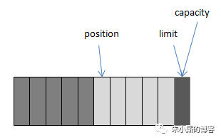
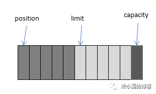

现在使用NIO的场景越来越多，很多网上的技术框架或多或少的使用NIO技术，譬如Tomcat，Jetty。学习和掌握NIO技术已经不是一个JAVA攻城狮的加分技能，而是一个必备技能。在前面2篇文章《[什么是Zero-Copy?](http://mp.weixin.qq.com/s?__biz=MzU0MzQ5MDA0Mw==&mid=2247483913&idx=1&sn=2da53737b8e8908cf3efdae9621c9698&chksm=fb0be89dcc7c618b0d5a1ba8ac654295454cfc2fa81fbae5a6de49bf0a91a305ca707e9864fc&scene=21#wechat_redirect)》和《[NIO相关基础篇](http://mp.weixin.qq.com/s?__biz=MzU0MzQ5MDA0Mw==&mid=2247483907&idx=1&sn=3d5e1384a36bd59f5fd14135067af1c2&chksm=fb0be897cc7c61815a6a1c3181f3ba3507b199fd7a8c9025e9d8f67b5e9783bc0f0fe1c73903&scene=21#wechat_redirect)》中我们学习了NIO的相关理论知识，而在本篇中我们一起来学习一下Java NIO的实战知识。全文较长，建议先马后看（记得关注不迷路）。

## 一、概述

NIO主要有三大核心部分：Channel(通道)，Buffer(缓冲区), Selector。传统IO基于字节流和字符流进行操作，而NIO基于Channel和Buffer(缓冲区)进行操作，数据总是从通道读取到缓冲区中，或者从缓冲区写入到通道中。Selector(选择区)用于监听多个通道的事件（比如：连接打开，数据到达）。因此，单个线程可以监听多个数据通道。

NIO和传统IO（一下简称IO）之间第一个最大的区别是，IO是面向流的，NIO是面向缓冲区的。 Java IO面向流意味着每次从流中读一个或多个字节，直至读取所有字节，它们没有被缓存在任何地方。此外，它不能前后移动流中的数据。如果需要前后移动从流中读取的数据，需要先将它缓存到一个缓冲区。NIO的缓冲导向方法略有不同。数据读取到一个它稍后处理的缓冲区，需要时可在缓冲区中前后移动。这就增加了处理过程中的灵活性。但是，还需要检查是否该缓冲区中包含所有您需要处理的数据。而且，需确保当更多的数据读入缓冲区时，不要覆盖缓冲区里尚未处理的数据。

IO的各种流是阻塞的。这意味着，当一个线程调用read() 或 write()时，该线程被阻塞，直到有一些数据被读取，或数据完全写入。该线程在此期间不能再干任何事情了。 NIO的非阻塞模式，使一个线程从某通道发送请求读取数据，但是它仅能得到目前可用的数据，如果目前没有数据可用时，就什么都不会获取。而不是保持线程阻塞，所以直至数据变得可以读取之前，该线程可以继续做其他的事情。 非阻塞写也是如此。一个线程请求写入一些数据到某通道，但不需要等待它完全写入，这个线程同时可以去做别的事情。 线程通常将非阻塞IO的空闲时间用于在其它通道上执行IO操作，所以一个单独的线程现在可以管理多个输入和输出通道（channel）。

### Channel

首先说一下Channel，国内大多翻译成“通道”。Channel和IO中的Stream(流)是差不多一个等级的。只不过Stream是单向的，譬如：InputStream, OutputStream.而Channel是双向的，既可以用来进行读操作，又可以用来进行写操作。
NIO中的Channel的主要实现有：

- FileChannel
- DatagramChannel
- SocketChannel
- ServerSocketChannel

这里看名字就可以猜出个所以然来：分别可以对应文件IO、UDP和TCP（Server和Client）。下面演示的案例基本上就是围绕这4个类型的Channel进行陈述的。

### Buffer

NIO中的关键Buffer实现有：ByteBuffer, CharBuffer, DoubleBuffer, FloatBuffer, IntBuffer, LongBuffer, ShortBuffer，分别对应基本数据类型: byte, char, double, float, int, long, short。当然NIO中还有MappedByteBuffer, HeapByteBuffer, DirectByteBuffer等这里先不进行陈述。

### Selector

Selector运行单线程处理多个Channel，如果你的应用打开了多个通道，但每个连接的流量都很低，使用Selector就会很方便。例如在一个聊天服务器中。要使用Selector, 得向Selector注册Channel，然后调用它的select()方法。这个方法会一直阻塞到某个注册的通道有事件就绪。一旦这个方法返回，线程就可以处理这些事件，事件的例子有如新的连接进来、数据接收等。

## 二、FileChannel

看完上面的陈述，对于第一次接触NIO的同学来说云里雾里，只说了一些概念，也没记住什么，更别说怎么用了。这里开始通过传统IO以及更改后的NIO来做对比，以更形象的突出NIO的用法，进而使你对NIO有一点点的了解。

### 传统IO vs NIO

首先，案例1是采用FileInputStream读取文件内容的：

```
    public static void method2(){
        InputStream in = null;
        try{
            in = new BufferedInputStream(new FileInputStream("src/nomal_io.txt"));
            byte [] buf = new byte[1024];
            int bytesRead = in.read(buf);
            while(bytesRead != -1)
            {
                for(int i=0;i<bytesRead;i++)
                    System.out.print((char)buf[i]);
                bytesRead = in.read(buf);
            }
        }catch (IOException e)
        {
            e.printStackTrace();
        }finally{
            try{
                if(in != null){
                    in.close();
                }
            }catch (IOException e){
                e.printStackTrace();
            }
        }
    }
```

输出结果：（略）

案例是对应的NIO（这里通过RandomAccessFile进行操作，当然也可以通过FileInputStream.getChannel()进行操作）：

```
    public static void method1(){
        RandomAccessFile aFile = null;
        try{
            aFile = new RandomAccessFile("src/nio.txt","rw");
            FileChannel fileChannel = aFile.getChannel();
            ByteBuffer buf = ByteBuffer.allocate(1024);
            int bytesRead = fileChannel.read(buf);
            System.out.println(bytesRead);
            while(bytesRead != -1)
            {
                buf.flip();
                while(buf.hasRemaining())
                {
                    System.out.print((char)buf.get());
                }
                buf.compact();
                bytesRead = fileChannel.read(buf);
            }
        }catch (IOException e){
            e.printStackTrace();
        }finally{
            try{
                if(aFile != null){
                    aFile.close();
                }
            }catch (IOException e){
                e.printStackTrace();
            }
        }
    }
```

输出结果：（略）
通过仔细对比案例1和案例2，应该能看出个大概，最起码能发现NIO的实现方式比叫复杂。有了一个大概的印象可以进入下一步了。

### Buffer的使用

从案例2中可以总结出使用Buffer一般遵循下面几个步骤：

- 分配空间（ByteBuffer buf = ByteBuffer.allocate(1024); 还有一种allocateDirector后面再陈述）
- 写入数据到Buffer(int bytesRead = fileChannel.read(buf);)
- 调用filp()方法（ buf.flip();）
- 从Buffer中读取数据（System.out.print((char)buf.get());）
- 调用clear()方法或者compact()方法

Buffer顾名思义：缓冲区，实际上是一个容器，一个连续数组。Channel提供从文件、网络读取数据的渠道，但是读写的数据都必须经过Buffer。如下图：


向Buffer中写数据：

- 从Channel写到Buffer (fileChannel.read(buf))
- 通过Buffer的put()方法 （buf.put(…)）

从Buffer中读取数据：

- 从Buffer读取到Channel (channel.write(buf))
- 使用get()方法从Buffer中读取数据 （buf.get()）

可以把Buffer简单地理解为一组基本数据类型的元素列表，它通过几个变量来保存这个数据的当前位置状态：capacity, position, limit, mark：

| **索引** | **说明**                                                |
| -------- | ------------------------------------------------------- |
| capacity | 缓冲区数组的总长度                                      |
| position | 下一个要操作的数据元素的位置                            |
| limit    | 缓冲区数组中不可操作的下一个元素的位置：limit<=capacity |
| mark     | 用于记录当前position的前一个位置或者默认是-1            |


无图无真相，举例：我们通过ByteBuffer.allocate(11)方法创建了一个11个byte的数组的缓冲区，初始状态如上图，position的位置为0，capacity和limit默认都是数组长度。当我们写入5个字节时，变化如下图：



这时我们需要将缓冲区中的5个字节数据写入Channel的通信信道，所以我们调用ByteBuffer.flip()方法，变化如下图所示(position设回0，并将limit设成之前的position的值)：



这时底层操作系统就可以从缓冲区中正确读取这个5个字节数据并发送出去了。在下一次写数据之前我们再调用clear()方法，缓冲区的索引位置又回到了初始位置。

调用clear()方法：position将被设回0，limit设置成capacity，换句话说，Buffer被清空了，其实Buffer中的数据并未被清除，只是这些标记告诉我们可以从哪里开始往Buffer里写数据。如果Buffer中有一些未读的数据，调用clear()方法，数据将“被遗忘”，意味着不再有任何标记会告诉你哪些数据被读过，哪些还没有。如果Buffer中仍有未读的数据，且后续还需要这些数据，但是此时想要先写些数据，那么使用compact()方法。compact()方法将所有未读的数据拷贝到Buffer起始处。然后将position设到最后一个未读元素正后面。limit属性依然像clear()方法一样，设置成capacity。现在Buffer准备好写数据了，但是不会覆盖未读的数据。

通过调用Buffer.mark()方法，可以标记Buffer中的一个特定的position，之后可以通过调用Buffer.reset()方法恢复到这个position。Buffer.rewind()方法将position设回0，所以你可以重读Buffer中的所有数据。limit保持不变，仍然表示能从Buffer中读取多少个元素。

## 三、SocketChannel

说完了FileChannel和Buffer, 大家应该对Buffer的用法比较了解了，这里使用SocketChannel来继续探讨NIO。NIO的强大功能部分来自于Channel的非阻塞特性，套接字的某些操作可能会无限期地阻塞。例如，对accept()方法的调用可能会因为等待一个客户端连接而阻塞；对read()方法的调用可能会因为没有数据可读而阻塞，直到连接的另一端传来新的数据。总的来说，创建/接收连接或读写数据等I/O调用，都可能无限期地阻塞等待，直到底层的网络实现发生了什么。慢速的，有损耗的网络，或仅仅是简单的网络故障都可能导致任意时间的延迟。然而不幸的是，在调用一个方法之前无法知道其是否阻塞。NIO的channel抽象的一个重要特征就是可以通过配置它的阻塞行为，以实现非阻塞式的信道。

```
            channel.configureBlocking(false)
```

在非阻塞式信道上调用一个方法总是会立即返回。这种调用的返回值指示了所请求的操作完成的程度。例如，在一个非阻塞式ServerSocketChannel上调用accept()方法，如果有连接请求来了，则返回客户端SocketChannel，否则返回null。

这里先举一个TCP应用案例，客户端采用NIO实现，而服务端依旧使用BIO实现。
客户端代码（案例3）：

```
    public static void client(){
        ByteBuffer buffer = ByteBuffer.allocate(1024);
        SocketChannel socketChannel = null;
        try
        {
            socketChannel = SocketChannel.open();
            socketChannel.configureBlocking(false);
            socketChannel.connect(new InetSocketAddress("10.10.195.115",8080));
            if(socketChannel.finishConnect())
            {
                int i=0;
                while(true)
                {
                    TimeUnit.SECONDS.sleep(1);
                    String info = "I'm "+i+++"-th information from client";
                    buffer.clear();
                    buffer.put(info.getBytes());
                    buffer.flip();
                    while(buffer.hasRemaining()){
                        System.out.println(buffer);
                        socketChannel.write(buffer);
                    }
                }
            }
        }
        catch (IOException | InterruptedException e)
        {
            e.printStackTrace();
        }
        finally{
            try{
                if(socketChannel!=null){
                    socketChannel.close();
                }
            }catch(IOException e){
                e.printStackTrace();
            }
        }
    }
```

服务端代码（案例4）：

```
    public static void server(){
        ServerSocket serverSocket = null;
        InputStream in = null;
        try
        {
            serverSocket = new ServerSocket(8080);
            int recvMsgSize = 0;
            byte[] recvBuf = new byte[1024];
            while(true){
                Socket clntSocket = serverSocket.accept();
                SocketAddress clientAddress = clntSocket.getRemoteSocketAddress();
                System.out.println("Handling client at "+clientAddress);
                in = clntSocket.getInputStream();
                while((recvMsgSize=in.read(recvBuf))!=-1){
                    byte[] temp = new byte[recvMsgSize];
                    System.arraycopy(recvBuf, 0, temp, 0, recvMsgSize);
                    System.out.println(new String(temp));
                }
            }
        }
        catch (IOException e)
        {
            e.printStackTrace();
        }
        finally{
            try{
                if(serverSocket!=null){
                    serverSocket.close();
                }
                if(in!=null){
                    in.close();
                }
            }catch(IOException e){
                e.printStackTrace();
            }
        }
    }
```

输出结果：（略）

根据案例分析，总结一下SocketChannel的用法。
打开SocketChannel：

```
            socketChannel = SocketChannel.open();
            socketChannel.connect(new InetSocketAddress("10.10.195.115",8080));
```

关闭：

```
            socketChannel.close();
```

读取数据：

```
                    String info = "I'm "+i+++"-th information from client";
                    buffer.clear();
                    buffer.put(info.getBytes());
                    buffer.flip();
                    while(buffer.hasRemaining()){
                        System.out.println(buffer);
                        socketChannel.write(buffer);
                    }
```

注意SocketChannel.write()方法的调用是在一个while循环中的。write()方法无法保证能写多少字节到SocketChannel。所以，我们重复调用write()直到Buffer没有要写的字节为止。
非阻塞模式下,read()方法在尚未读取到任何数据时可能就返回了。所以需要关注它的int返回值，它会告诉你读取了多少字节。

## 四、TCP服务端的NIO写法

到目前为止，所举的案例中都没有涉及Selector。不要急，好东西要慢慢来。Selector类可以用于避免使用阻塞式客户端中很浪费资源的“忙等”方法。例如，考虑一个IM服务器。像QQ或者旺旺这样的，可能有几万甚至几千万个客户端同时连接到了服务器，但在任何时刻都只是非常少量的消息。

需要读取和分发。这就需要一种方法阻塞等待，直到至少有一个信道可以进行I/O操作，并指出是哪个信道。NIO的选择器就实现了这样的功能。一个Selector实例可以同时检查一组信道的I/O状态。用专业术语来说，选择器就是一个多路开关选择器，因为一个选择器能够管理多个信道上的I/O操作。然而如果用传统的方式来处理这么多客户端，使用的方法是循环地一个一个地去检查所有的客户端是否有I/O操作，如果当前客户端有I/O操作，则可能把当前客户端扔给一个线程池去处理，如果没有I/O操作则进行下一个轮询，当所有的客户端都轮询过了又接着从头开始轮询；这种方法是非常笨而且也非常浪费资源，因为大部分客户端是没有I/O操作，我们也要去检查；而Selector就不一样了，它在内部可以同时管理多个I/O，当一个信道有I/O操作的时候，他会通知Selector，Selector就是记住这个信道有I/O操作，并且知道是何种I/O操作，是读呢？是写呢？还是接受新的连接；所以如果使用Selector，它返回的结果只有两种结果，一种是0，即在你调用的时刻没有任何客户端需要I/O操作，另一种结果是一组需要I/O操作的客户端，这时你就根本不需要再检查了，因为它返回给你的肯定是你想要的。这样一种通知的方式比那种主动轮询的方式要高效得多！

要使用选择器（Selector），需要创建一个Selector实例（使用静态工厂方法open()）并将其注册（register）到想要监控的信道上（注意，这要通过channel的方法实现，而不是使用selector的方法）。最后，调用选择器的select()方法。该方法会阻塞等待，直到有一个或更多的信道准备好了I/O操作或等待超时。select()方法将返回可进行I/O操作的信道数量。现在，在一个单独的线程中，通过调用select()方法就能检查多个信道是否准备好进行I/O操作。如果经过一段时间后仍然没有信道准备好，select()方法就会返回0，并允许程序继续执行其他任务。

下面将上面的TCP服务端代码改写成NIO的方式（案例5）：

```
public class ServerConnect
{
    private static final int BUF_SIZE=1024;
    private static final int PORT = 8080;
    private static final int TIMEOUT = 3000;
    public static void main(String[] args)
    {
        selector();
    }
    public static void handleAccept(SelectionKey key) throws IOException{
        ServerSocketChannel ssChannel = (ServerSocketChannel)key.channel();
        SocketChannel sc = ssChannel.accept();
        sc.configureBlocking(false);
        sc.register(key.selector(), SelectionKey.OP_READ,ByteBuffer.allocateDirect(BUF_SIZE));
    }
    public static void handleRead(SelectionKey key) throws IOException{
        SocketChannel sc = (SocketChannel)key.channel();
        ByteBuffer buf = (ByteBuffer)key.attachment();
        long bytesRead = sc.read(buf);
        while(bytesRead>0){
            buf.flip();
            while(buf.hasRemaining()){
                System.out.print((char)buf.get());
            }
            System.out.println();
            buf.clear();
            bytesRead = sc.read(buf);
        }
        if(bytesRead == -1){
            sc.close();
        }
    }
    public static void handleWrite(SelectionKey key) throws IOException{
        ByteBuffer buf = (ByteBuffer)key.attachment();
        buf.flip();
        SocketChannel sc = (SocketChannel) key.channel();
        while(buf.hasRemaining()){
            sc.write(buf);
        }
        buf.compact();
    }
    public static void selector() {
        Selector selector = null;
        ServerSocketChannel ssc = null;
        try{
            selector = Selector.open();
            ssc= ServerSocketChannel.open();
            ssc.socket().bind(new InetSocketAddress(PORT));
            ssc.configureBlocking(false);
            ssc.register(selector, SelectionKey.OP_ACCEPT);
            while(true){
                if(selector.select(TIMEOUT) == 0){
                    System.out.println("==");
                    continue;
                }
                Iterator<SelectionKey> iter = selector.selectedKeys().iterator();
                while(iter.hasNext()){
                    SelectionKey key = iter.next();
                    if(key.isAcceptable()){
                        handleAccept(key);
                    }
                    if(key.isReadable()){
                        handleRead(key);
                    }
                    if(key.isWritable() && key.isValid()){
                        handleWrite(key);
                    }
                    if(key.isConnectable()){
                        System.out.println("isConnectable = true");
                    }
                    iter.remove();
                }
            }
        }catch(IOException e){
            e.printStackTrace();
        }finally{
            try{
                if(selector!=null){
                    selector.close();
                }
                if(ssc!=null){
                    ssc.close();
                }
            }catch(IOException e){
                e.printStackTrace();
            }
        }
    }
}
```

下面来慢慢讲解这段代码。

### ServerSocketChannel

打开ServerSocketChannel：

```
ServerSocketChannel serverSocketChannel = ServerSocketChannel.open();
```

关闭ServerSocketChannel：

```
serverSocketChannel.close();
```

监听新进来的连接：

```
while(true){
    SocketChannel socketChannel = serverSocketChannel.accept();
}
```

ServerSocketChannel可以设置成非阻塞模式。在非阻塞模式下，accept() 方法会立刻返回，如果还没有新进来的连接,返回的将是null。 因此，需要检查返回的SocketChannel是否是null.如：

```
        ServerSocketChannel serverSocketChannel = ServerSocketChannel.open();
        serverSocketChannel.socket().bind(new InetSocketAddress(9999));
        serverSocketChannel.configureBlocking(false);
        while (true)
        {
            SocketChannel socketChannel = serverSocketChannel.accept();
            if (socketChannel != null)
            {
                // do something with socketChannel...
            }
        }
```

### Selector

Selector的创建：Selector selector = Selector.open();

为了将Channel和Selector配合使用，必须将Channel注册到Selector上，通过SelectableChannel.register()方法来实现，沿用案例5中的部分代码：

```
            ssc= ServerSocketChannel.open();
            ssc.socket().bind(new InetSocketAddress(PORT));
            ssc.configureBlocking(false);
            ssc.register(selector, SelectionKey.OP_ACCEPT);
```

与Selector一起使用时，Channel必须处于非阻塞模式下。这意味着不能将FileChannel与Selector一起使用，因为FileChannel不能切换到非阻塞模式。而套接字通道都可以。

注意register()方法的第二个参数。这是一个“interest集合”，意思是在通过Selector监听Channel时对什么事件感兴趣。可以监听四种不同类型的事件：

```
1. Connect
2. Accept
3. Read
4. Write
```

通道触发了一个事件意思是该事件已经就绪。所以，某个channel成功连接到另一个服务器称为“连接就绪”。一个server socket channel准备好接收新进入的连接称为“接收就绪”。一个有数据可读的通道可以说是“读就绪”。等待写数据的通道可以说是“写就绪”。

这四种事件用SelectionKey的四个常量来表示：

```
1. SelectionKey.OP_CONNECT
2. SelectionKey.OP_ACCEPT
3. SelectionKey.OP_READ
4. SelectionKey.OP_WRITE
```

### SelectionKey

当向Selector注册Channel时，register()方法会返回一个SelectionKey对象。这个对象包含了一些你感兴趣的属性：

- interest集合
- ready集合
- Channel
- Selector
- 附加的对象（可选）

interest集合：就像向Selector注册通道一节中所描述的，interest集合是你所选择的感兴趣的事件集合。可以通过SelectionKey读写interest集合。

ready 集合是通道已经准备就绪的操作的集合。在一次选择(Selection)之后，你会首先访问这个ready set。Selection将在下一小节进行解释。可以这样访问ready集合：

```
int readySet = selectionKey.readyOps();
```

可以用像检测interest集合那样的方法，来检测channel中什么事件或操作已经就绪。但是，也可以使用以下四个方法，它们都会返回一个布尔类型：

```
selectionKey.isAcceptable();
selectionKey.isConnectable();
selectionKey.isReadable();
selectionKey.isWritable();
```

从SelectionKey访问Channel和Selector很简单。如下：

```
Channel  channel  = selectionKey.channel();
Selector selector = selectionKey.selector();
```

可以将一个对象或者更多信息附着到SelectionKey上，这样就能方便的识别某个给定的通道。例如，可以附加 与通道一起使用的Buffer，或是包含聚集数据的某个对象。使用方法如下：

```
selectionKey.attach(theObject);
Object attachedObj = selectionKey.attachment();
```

还可以在用register()方法向Selector注册Channel的时候附加对象。如：

```
SelectionKey key = channel.register(selector, SelectionKey.OP_READ, theObject);
```

### 通过Selector选择通道

一旦向Selector注册了一或多个通道，就可以调用几个重载的select()方法。这些方法返回你所感兴趣的事件（如连接、接受、读或写）已经准备就绪的那些通道。换句话说，如果你对“读就绪”的通道感兴趣，select()方法会返回读事件已经就绪的那些通道。

下面是select()方法：

- int select()
- int select(long timeout)
- int selectNow()

select()阻塞到至少有一个通道在你注册的事件上就绪了。
select(long timeout)和select()一样，除了最长会阻塞timeout毫秒(参数)。
selectNow()不会阻塞，不管什么通道就绪都立刻返回（译者注：此方法执行非阻塞的选择操作。如果自从前一次选择操作后，没有通道变成可选择的，则此方法直接返回零。）。

select()方法返回的int值表示有多少通道已经就绪。亦即，自上次调用select()方法后有多少通道变成就绪状态。如果调用select()方法，因为有一个通道变成就绪状态，返回了1，若再次调用select()方法，如果另一个通道就绪了，它会再次返回1。如果对第一个就绪的channel没有做任何操作，现在就有两个就绪的通道，但在每次select()方法调用之间，只有一个通道就绪了。

一旦调用了select()方法，并且返回值表明有一个或更多个通道就绪了，然后可以通过调用selector的selectedKeys()方法，访问“已选择键集（selected key set）”中的就绪通道。如下所示：

```
Set selectedKeys = selector.selectedKeys();
```

当向Selector注册Channel时，Channel.register()方法会返回一个SelectionKey 对象。这个对象代表了注册到该Selector的通道。

注意每次迭代末尾的keyIterator.remove()调用。Selector不会自己从已选择键集中移除SelectionKey实例。必须在处理完通道时自己移除。下次该通道变成就绪时，Selector会再次将其放入已选择键集中。

SelectionKey.channel()方法返回的通道需要转型成你要处理的类型，如ServerSocketChannel或SocketChannel等。

一个完整的使用Selector和ServerSocketChannel的案例可以参考案例5的selector()方法。

------

## 五、内存映射文件

JAVA处理大文件，一般用BufferedReader,BufferedInputStream这类带缓冲的IO类，不过如果文件超大的话，更快的方式是采用MappedByteBuffer。

MappedByteBuffer是NIO引入的文件内存映射方案，读写性能极高。NIO最主要的就是实现了对异步操作的支持。其中一种通过把一个套接字通道(SocketChannel)注册到一个选择器(Selector)中,不时调用后者的选择(select)方法就能返回满足的选择键(SelectionKey),键中包含了SOCKET事件信息。这就是select模型。

SocketChannel的读写是通过一个类叫ByteBuffer来操作的.这个类本身的设计是不错的,比直接操作byte[]方便多了. ByteBuffer有两种模式:直接/间接.间接模式最典型(也只有这么一种)的就是HeapByteBuffer,即操作堆内存 (byte[]).但是内存毕竟有限,如果我要发送一个1G的文件怎么办?不可能真的去分配1G的内存.这时就必须使用"直接"模式,即 MappedByteBuffer,文件映射.

先中断一下,谈谈操作系统的内存管理.一般操作系统的内存分两部分:物理内存;虚拟内存.虚拟内存一般使用的是页面映像文件,即硬盘中的某个(某些)特殊的文件.操作系统负责页面文件内容的读写,这个过程叫"页面中断/切换". MappedByteBuffer也是类似的,你可以把整个文件(不管文件有多大)看成是一个ByteBuffer.MappedByteBuffer 只是一种特殊的ByteBuffer，即是ByteBuffer的子类。 MappedByteBuffer 将文件直接映射到内存（这里的内存指的是虚拟内存，并不是物理内存）。通常，可以映射整个文件，如果文件比较大的话可以分段进行映射，只要指定文件的那个部分就可以。

### 概念

FileChannel提供了map方法来把文件影射为内存映像文件： MappedByteBuffer map(int mode,long position,long size); 可以把文件的从position开始的size大小的区域映射为内存映像文件，mode指出了 可访问该内存映像文件的方式：

- READ_ONLY,（只读）： 试图修改得到的缓冲区将导致抛出 ReadOnlyBufferException.(MapMode.READ_ONLY)
- READ_WRITE（读/写）： 对得到的缓冲区的更改最终将传播到文件；该更改对映射到同一文件的其他程序不一定是可见的。 (MapMode.READ_WRITE)
- PRIVATE（专用）： 对得到的缓冲区的更改不会传播到文件，并且该更改对映射到同一文件的其他程序也不是可见的；相反，会创建缓冲区已修改部分的专用副本。 (MapMode.PRIVATE)

MappedByteBuffer是ByteBuffer的子类，其扩充了三个方法：

- force()：缓冲区是READ_WRITE模式下，此方法对缓冲区内容的修改强行写入文件；
- load()：将缓冲区的内容载入内存，并返回该缓冲区的引用；
- isLoaded()：如果缓冲区的内容在物理内存中，则返回真，否则返回假；

### 案例对比

这里通过采用ByteBuffer和MappedByteBuffer分别读取大小约为5M的文件"src/1.ppt"来比较两者之间的区别，method3()是采用MappedByteBuffer读取的，method4()对应的是ByteBuffer。

```
    public static void method4(){
        RandomAccessFile aFile = null;
        FileChannel fc = null;
        try{
            aFile = new RandomAccessFile("src/1.ppt","rw");
            fc = aFile.getChannel();
            long timeBegin = System.currentTimeMillis();
            ByteBuffer buff = ByteBuffer.allocate((int) aFile.length());
            buff.clear();
            fc.read(buff);
            //System.out.println((char)buff.get((int)(aFile.length()/2-1)));
            //System.out.println((char)buff.get((int)(aFile.length()/2)));
            //System.out.println((char)buff.get((int)(aFile.length()/2)+1));
            long timeEnd = System.currentTimeMillis();
            System.out.println("Read time: "+(timeEnd-timeBegin)+"ms");
        }catch(IOException e){
            e.printStackTrace();
        }finally{
            try{
                if(aFile!=null){
                    aFile.close();
                }
                if(fc!=null){
                    fc.close();
                }
            }catch(IOException e){
                e.printStackTrace();
            }
        }
    }
    public static void method3(){
        RandomAccessFile aFile = null;
        FileChannel fc = null;
        try{
            aFile = new RandomAccessFile("src/1.ppt","rw");
            fc = aFile.getChannel();
            long timeBegin = System.currentTimeMillis();
            MappedByteBuffer mbb = fc.map(FileChannel.MapMode.READ_ONLY, 0, aFile.length());
            // System.out.println((char)mbb.get((int)(aFile.length()/2-1)));
            // System.out.println((char)mbb.get((int)(aFile.length()/2)));
            //System.out.println((char)mbb.get((int)(aFile.length()/2)+1));
            long timeEnd = System.currentTimeMillis();
            System.out.println("Read time: "+(timeEnd-timeBegin)+"ms");
        }catch(IOException e){
            e.printStackTrace();
        }finally{
            try{
                if(aFile!=null){
                    aFile.close();
                }
                if(fc!=null){
                    fc.close();
                }
            }catch(IOException e){
                e.printStackTrace();
            }
        }
    }
```

通过在入口函数main()中运行：

```
        method3();
        System.out.println("=============");
        method4();
```

输出结果（运行在普通PC机上）：

```
Read time: 2ms
=============
Read time: 12ms
```

通过输出结果可以看出彼此的差别，一个例子也许是偶然，那么下面把5M大小的文件替换为200M的文件，输出结果：

```
Read time: 1ms
=============
Read time: 407ms
```

可以看到差距拉大。

> 注：MappedByteBuffer有资源释放的问题：被MappedByteBuffer打开的文件只有在垃圾收集时才会被关闭，而这个点是不确定的。在Javadoc中这里描述：A mapped byte buffer and the file mapping that it represents remian valid until the buffer itself is garbage-collected。详细可以翻阅参考资料5和6.

------

## 六、其余功能介绍

看完以上陈述，详细大家对NIO有了一定的了解，下面主要通过几个案例，来说明NIO的其余功能，下面代码量偏多，功能性讲述偏少。

### Scatter/Gatter

分散（scatter）从Channel中读取是指在读操作时将读取的数据写入多个buffer中。因此，Channel将从Channel中读取的数据“分散（scatter）”到多个Buffer中。

聚集（gather）写入Channel是指在写操作时将多个buffer的数据写入同一个Channel，因此，Channel 将多个Buffer中的数据“聚集（gather）”后发送到Channel。

scatter / gather经常用于需要将传输的数据分开处理的场合，例如传输一个由消息头和消息体组成的消息，你可能会将消息体和消息头分散到不同的buffer中，这样你可以方便的处理消息头和消息体。

案例：

```
import java.io.File;
import java.io.FileNotFoundException;
import java.io.FileOutputStream;
import java.io.IOException;
import java.io.OutputStream;
import java.nio.ByteBuffer;
import java.nio.channels.Channel;
import java.nio.channels.FileChannel;
public class ScattingAndGather
{
    public static void main(String args[]){
        gather();
    }
    public static void gather()
    {
        ByteBuffer header = ByteBuffer.allocate(10);
        ByteBuffer body = ByteBuffer.allocate(10);
        byte [] b1 = {'0', '1'};
        byte [] b2 = {'2', '3'};
        header.put(b1);
        body.put(b2);
        ByteBuffer [] buffs = {header, body};
        try
        {
            FileOutputStream os = new FileOutputStream("src/scattingAndGather.txt");
            FileChannel channel = os.getChannel();
            channel.write(buffs);
        }
        catch (IOException e)
        {
            e.printStackTrace();
        }
    }
}
```

### transferFrom & transferTo

FileChannel的transferFrom()方法可以将数据从源通道传输到FileChannel中。

```
    public static void method1(){
        RandomAccessFile fromFile = null;
        RandomAccessFile toFile = null;
        try
        {
            fromFile = new RandomAccessFile("src/fromFile.xml","rw");
            FileChannel fromChannel = fromFile.getChannel();
            toFile = new RandomAccessFile("src/toFile.txt","rw");
            FileChannel toChannel = toFile.getChannel();
            long position = 0;
            long count = fromChannel.size();
            System.out.println(count);
            toChannel.transferFrom(fromChannel, position, count);
        }
        catch (IOException e)
        {
            e.printStackTrace();
        }
        finally{
            try{
                if(fromFile != null){
                    fromFile.close();
                }
                if(toFile != null){
                    toFile.close();
                }
            }
            catch(IOException e){
                e.printStackTrace();
            }
        }
    }
```

方法的输入参数position表示从position处开始向目标文件写入数据，count表示最多传输的字节数。如果源通道的剩余空间小于 count 个字节，则所传输的字节数要小于请求的字节数。此外要注意，在SoketChannel的实现中，SocketChannel只会传输此刻准备好的数据（可能不足count字节）。因此，SocketChannel可能不会将请求的所有数据(count个字节)全部传输到FileChannel中。

transferTo()方法将数据从FileChannel传输到其他的channel中。

```
    public static void method2()
    {
        RandomAccessFile fromFile = null;
        RandomAccessFile toFile = null;
        try
        {
            fromFile = new RandomAccessFile("src/fromFile.txt","rw");
            FileChannel fromChannel = fromFile.getChannel();
            toFile = new RandomAccessFile("src/toFile.txt","rw");
            FileChannel toChannel = toFile.getChannel();
            long position = 0;
            long count = fromChannel.size();
            System.out.println(count);
            fromChannel.transferTo(position, count,toChannel);
        }
        catch (IOException e)
        {
            e.printStackTrace();
        }
        finally{
            try{
                if(fromFile != null){
                    fromFile.close();
                }
                if(toFile != null){
                    toFile.close();
                }
            }
            catch(IOException e){
                e.printStackTrace();
            }
        }
    }
```

上面所说的关于SocketChannel的问题在transferTo()方法中同样存在。SocketChannel会一直传输数据直到目标buffer被填满。

### Pipe

Java NIO 管道是2个线程之间的单向数据连接。Pipe有一个source通道和一个sink通道。数据会被写到sink通道，从source通道读取。

```
    public static void method1(){
        Pipe pipe = null;
        ExecutorService exec = Executors.newFixedThreadPool(2);
        try{
            pipe = Pipe.open();
            final Pipe pipeTemp = pipe;
            exec.submit(new Callable<Object>(){
                @Override
                public Object call() throws Exception
                {
                    Pipe.SinkChannel sinkChannel = pipeTemp.sink();//向通道中写数据
                    while(true){
                        TimeUnit.SECONDS.sleep(1);
                        String newData = "Pipe Test At Time "+System.currentTimeMillis();
                        ByteBuffer buf = ByteBuffer.allocate(1024);
                        buf.clear();
                        buf.put(newData.getBytes());
                        buf.flip();
                        while(buf.hasRemaining()){
                            System.out.println(buf);
                            sinkChannel.write(buf);
                        }
                    }
                }
            });
            exec.submit(new Callable<Object>(){
                @Override
                public Object call() throws Exception
                {
                    Pipe.SourceChannel sourceChannel = pipeTemp.source();//向通道中读数据
                    while(true){
                        TimeUnit.SECONDS.sleep(1);
                        ByteBuffer buf = ByteBuffer.allocate(1024);
                        buf.clear();
                        int bytesRead = sourceChannel.read(buf);
                        System.out.println("bytesRead="+bytesRead);
                        while(bytesRead >0 ){
                            buf.flip();
                            byte b[] = new byte[bytesRead];
                            int i=0;
                            while(buf.hasRemaining()){
                                b[i]=buf.get();
                                System.out.printf("%X",b[i]);
                                i++;
                            }
                            String s = new String(b);
                            System.out.println("=================||"+s);
                            bytesRead = sourceChannel.read(buf);
                        }
                    }
                }
            });
        }catch(IOException e){
            e.printStackTrace();
        }finally{
            exec.shutdown();
        }
    }
```

### DatagramChannel

Java NIO中的DatagramChannel是一个能收发UDP包的通道。因为UDP是无连接的网络协议，所以不能像其它通道那样读取和写入。它发送和接收的是数据包。

```
    public static void  reveive(){
        DatagramChannel channel = null;
        try{
            channel = DatagramChannel.open();
            channel.socket().bind(new InetSocketAddress(8888));
            ByteBuffer buf = ByteBuffer.allocate(1024);
            buf.clear();
            channel.receive(buf);
            buf.flip();
            while(buf.hasRemaining()){
                System.out.print((char)buf.get());
            }
            System.out.println();
        }catch(IOException e){
            e.printStackTrace();
        }finally{
            try{
                if(channel!=null){
                    channel.close();
                }
            }catch(IOException e){
                e.printStackTrace();
            }
        }
    }
    public static void send(){
        DatagramChannel channel = null;
        try{
            channel = DatagramChannel.open();
            String info = "I'm the Sender!";
            ByteBuffer buf = ByteBuffer.allocate(1024);
            buf.clear();
            buf.put(info.getBytes());
            buf.flip();
            int bytesSent = channel.send(buf, new InetSocketAddress("10.10.195.115",8888));
            System.out.println(bytesSent);
        }catch(IOException e){
            e.printStackTrace();
        }finally{
            try{
                if(channel!=null){
                    channel.close();
                }
            }catch(IOException e){
                e.printStackTrace();
            }
        }
    }
```


END