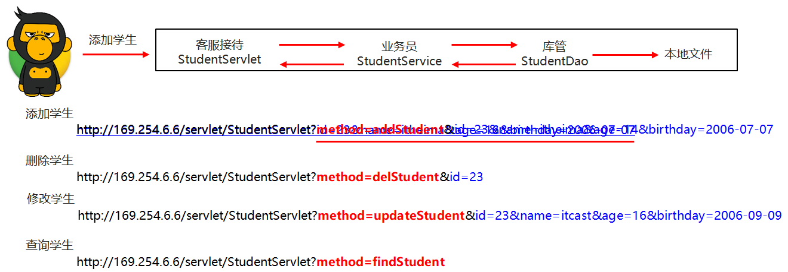
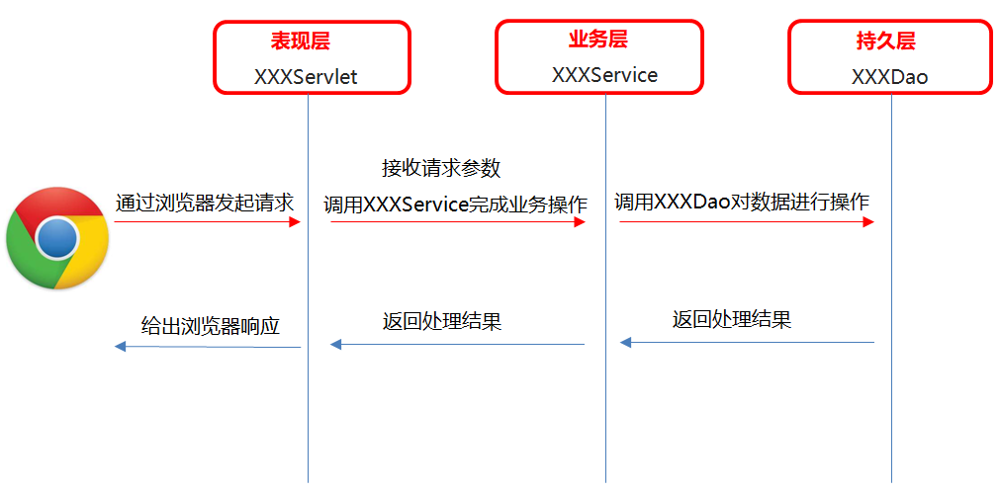
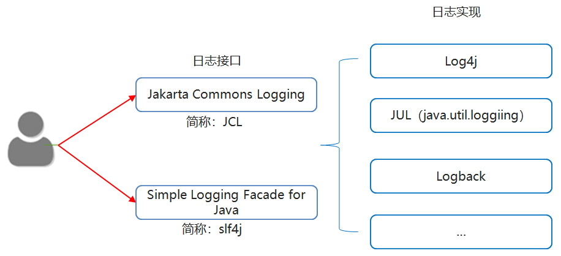

## 1.管理系统与服务器集成

### 1.1准备工作【应用】

+ 需求

  对之前写过的黑马信息管理系统进行改进,实现可以通过浏览器进行访问的功能

+ 准备工作

  + 将资料中的黑马管理系统代码拷贝到当前模块下

  + 导包的代码可能报错,因为之前的包路径可能和当前代码不一致,将导包的代码修改下

    <!--more-->

    

+ 业务分析

  

  

  1. 解析URL封装到HttpReques对象
  2. DynamicResourceProcess类（执行指定动态资源的service方法）
  3. 定义servlet类完成查询学生、添加学生、删除学生、修改学生的逻辑

+ 项目结构

  

  

### 1.2HttpRequest类代码实现【应用】

+ 实现步骤

  1. 提供一个存储url中用户信息的map集合
  2. 提供一个getParamter方法,用于根据请求参数的名称获取请求参数的值
  3. 提供一个parseParamter方法,用于解析请求参数把请求参数存储到map集合中

+ 代码实现

  ```java
  // 此处只给出了新增的代码,其他代码同之前没有变化
  public class HttpRequest {
     
      //用来存储请求URL中问号后面的那些数据
      //id=1  name=itheima
      private Map<String,String> paramterHashMap = new HashMap<>();
  
      //parse --- 获取请求数据 并解析
      public void parse(){
          try {
              SocketChannel socketChannel = (SocketChannel) selectionKey.channel();
              StringBuilder sb = new StringBuilder();
              //创建一个缓冲区
              ByteBuffer byteBuffer = ByteBuffer.allocate(1024);
              int len;
              //循环读取
              while((len = socketChannel.read(byteBuffer)) > 0){
                  byteBuffer.flip();
                  sb.append(new String(byteBuffer.array(),0,len));
                  //System.out.println(new String(byteBuffer.array(),0,len));
                  byteBuffer.clear();
              }
              //System.out.println(sb);
              parseHttpRequest(sb);
  
              //解析请求参数，把请求参数存储到paramterHashMap集合
              parseParamter();
  
          } catch (IOException e) {
              e.printStackTrace();
          }
      }
  
      //解析请求参数，把请求参数存储到paramterHashMap集合
      private void parseParamter(){
          //获取请求的uri
          String requestURI = this.requestURI;
          //按照问号进行切割，然后再获取到第二部分
          String[] uriInfoArr = requestURI.split("\\?");
          //判断数组的长度，如果长度为2，说明是存在请求参数。
          if(uriInfoArr.length == 2){
              //获取请求参数内容（问号后面的那些参数）
              String paramterInfo = uriInfoArr[1];
  
              //使用&进行切割
              String[] paramterInfoArr = paramterInfo.split("&");
  
              //遍历数组
              //id=1 name=itheima age =23
              for (String paramter : paramterInfoArr) {
                  String[] paramterArr = paramter.split("=");
                  //获取请求参数名称
                  String paramterName = paramterArr[0];
                  //获取请求参数的值
                  String paramterValue = paramterArr[1];
                  //添加到集合中
                  paramterHashMap.put(paramterName,paramterValue);
              }
          }
      }
    
      //id=1 name=itheima
      //可以根据请求参数的名称来获取请求参数的值
      public String getParamter(String name){
          return paramterHashMap.get(name);
      }
  
  }
  ```

### 1.3DynamicResourceProcess类代码实现【应用】

+ 实现步骤

  获取的uri是包含?后边的数据的,要进行切割,只要?号前边的内容


+ 代码实现

  ```java
  // 此处只给出了新增的代码,其他代码同之前没有变化
  public class DynamicResourceProcess {
  
      public void process(HttpRequest httpRequest,HttpResponse httpResponse){
          //获取请求的uri
          String requestURI = httpRequest.getRequestURI();
          //对requestURI进行切割操作
          String[] split = requestURI.split("\\?");
          //根据请求的uri到map集合中直接找到对应的servlet的对象
          HttpServlet httpServlet = ServletConcurrentHashMap.map.get(split[0]);
          System.out.println(httpServlet);
        	// ...
      }
  }  
  ```

### 1.4StudentServlet类代码实现【应用】

+ 实现步骤

  1. 在service方法中获取请求参数中的数据
  2. 判断是要添加学生还是修改学生等
  3. 调用对应的方法,执行对应的操作

+ 代码实现

  ```java
  @WebServlet(urlPatterns = "/servlet/studentservlet")
  public class StudentServlet implements HttpServlet {
  
      @Override
      public void service(HttpRequest httpRequest, HttpResponse httpResponse) {
          //获取method请求参数
          String method = httpRequest.getParamter("method");
          System.out.println(method);
          //判断
          if ("addStudent".equals(method)) {
              //添加学生
              addStudent(httpRequest, httpResponse);
          } else if ("delStudent".equals(method)) {
              //删除学生
              delStudent(httpRequest, httpResponse);
          } else if ("updateStudent".equals(method)) {
              //修改学生
              updateStudent(httpRequest, httpResponse);
          } else if ("findStudent".equals(method)) {
              //查询学生
              findStudent(httpRequest, httpResponse);
          }
      }
  
      //查询学生
      private void findStudent(HttpRequest httpRequest, HttpResponse httpResponse) {
      }
  
      //修改学生
      private void updateStudent(HttpRequest httpRequest, HttpResponse httpResponse) {
      }
  
      //删除学生
      private void delStudent(HttpRequest httpRequest, HttpResponse httpResponse) {
      }
  
      //添加学生
      private void addStudent(HttpRequest httpRequest, HttpResponse httpResponse) {   
      }
  }
  ```

### 1.5查询学生【应用】

+ 实现步骤

  1. 创建StudentService对象
  2. 调用StudentService中的findAllStudent方法，完成学生数据的查询操作
  3. 遍历数组，拼接成一个字符串
  4. 将拼接的结果响应给浏览器

+ 代码实现

  ```java
  @WebServlet(urlPatterns = "/servlet/studentservlet")
  public class StudentServlet implements HttpServlet {
      //1.创建StudentService对象
      private StudentService studentService = new StudentService();
  
      @Override
      public void service(HttpRequest httpRequest, HttpResponse httpResponse) {
          //获取method请求参数
  
          String method = httpRequest.getParamter("method");
          System.out.println(method);
          //判断
          if ("addStudent".equals(method)) {
              //添加学生
              addStudent(httpRequest, httpResponse);
          } else if ("delStudent".equals(method)) {
              //删除学生
              delStudent(httpRequest, httpResponse);
          } else if ("updateStudent".equals(method)) {
              //修改学生
              updateStudent(httpRequest, httpResponse);
          } else if ("findStudent".equals(method)) {
              //查询学生
              findStudent(httpRequest, httpResponse);
          }
      }
  
      //查询学生
      private void findStudent(HttpRequest httpRequest, HttpResponse httpResponse) {
          //2.调用StudentService中的findAllStudent方法，完成学生数据的查询操作
          Student[] allStudent = studentService.findAllStudent();
          //3.遍历数组，拼接成一个字符串
          StringBuilder sb = new StringBuilder();
          for (Student student : allStudent) {
              sb.append(student.getId()).append(", ").append(student.getName()).
                      append(", ").append(student.getAge()).append(", ").
                      append(student.getBirthday()).append("<br>");
          }
          String result = sb.toString();
          //4.将拼接的结果响应给浏览器
          //告诉浏览器响应的类型
          httpResponse.setContentTpye("text/html;charset=UTF-8");
          if (result == null || "".equals(result)) {
              httpResponse.write("暂无学生数据。。。。");
          } else {
              httpResponse.write(result);
          }
      }
      //修改学生
      private void updateStudent(HttpRequest httpRequest, HttpResponse httpResponse) {
      }
  
      //删除学生
      private void delStudent(HttpRequest httpRequest, HttpResponse httpResponse) {
      }
  
      //添加学生
      private void addStudent(HttpRequest httpRequest, HttpResponse httpResponse) {   
      }
  }  
  ```

### 1.6添加学生【应用】

+ 实现步骤

  1. 获取id的请求参数
  2. 判断id是否重复
  3. 如果重复。给浏览器响应，id已经重复
  4. 如果id不重复。添加学生。并给浏览器响应添加学生成功

+ 代码实现

  ```java
  @WebServlet(urlPatterns = "/servlet/studentservlet")
  public class StudentServlet implements HttpServlet {
      //1.创建StudentService对象
      private StudentService studentService = new StudentService();
  
      @Override
      public void service(HttpRequest httpRequest, HttpResponse httpResponse) {
          //获取method请求参数
  
          String method = httpRequest.getParamter("method");
          System.out.println(method);
          //判断
          if ("addStudent".equals(method)) {
              //添加学生
              addStudent(httpRequest, httpResponse);
          } else if ("delStudent".equals(method)) {
              //删除学生
              delStudent(httpRequest, httpResponse);
          } else if ("updateStudent".equals(method)) {
              //修改学生
              updateStudent(httpRequest, httpResponse);
          } else if ("findStudent".equals(method)) {
              //查询学生
              findStudent(httpRequest, httpResponse);
          }
      }
  
      //查询学生
      private void findStudent(HttpRequest httpRequest, HttpResponse httpResponse) {
         //...
      }
      //修改学生
      private void updateStudent(HttpRequest httpRequest, HttpResponse httpResponse) {
      }
      //删除学生
      private void delStudent(HttpRequest httpRequest, HttpResponse httpResponse) {
      }
      //添加学生
      private void addStudent(HttpRequest httpRequest, HttpResponse httpResponse) {
          //1.获取id的请求参数
          String id = httpRequest.getParamter("id");
          //2.判断id是否重复
          boolean exists = studentService.isExists(id);
          httpResponse.setContentTpye("text/html;charset=UTF-8");
          if (exists) {
              //3.如果重复。给浏览器响应，id已经重复
              httpResponse.write("id已经存在，请重新输入。。。");
          } else {
              //4.如果id不重复。添加学生。并给浏览器响应添加学生成功
              String name = httpRequest.getParamter("name");
              String age = httpRequest.getParamter("age");
              String birthday = httpRequest.getParamter("birthday");
              //对数据进行处理
              try {
                  int ageInt = Integer.parseInt(age);
                  SimpleDateFormat sdf = new SimpleDateFormat("yyyy-MM-dd");
                  Date date = sdf.parse(birthday);
                  //创建一个学生对象
                  Student s = new Student();
                  s.setId(id);
                  s.setName(name);
                  s.setAge(age);
                  s.setBirthday(birthday);
                  //调用studentservice里面的方法
                  studentService.addStudent(s);
                  //给浏览器响应
                  httpResponse.write("学生数据添加成功....");
              } catch (ParseException e) {
                  httpResponse.write("日期格式不正确，正确的格式为:yyyy-MM-dd");
                  e.printStackTrace();
              } catch (NumberFormatException e) {
                  httpResponse.write("年龄只能为整数");
                  e.printStackTrace();
              }
              //birthday  yyyy-MM-dd
          }
      }
  }
  ```

## 2.单元测试

### 2.1概述【理解】

JUnit是一个 Java 编程语言的单元测试工具。JUnit 是一个非常重要的测试工具

### 2.2特点【理解】

+ JUnit是一个开放源代码的测试工具。
+ 提供注解来识别测试方法。
+ JUnit测试可以让你编写代码更快，并能提高质量。
+ JUnit优雅简洁。没那么复杂，花费时间较少。
+ JUnit在一个条中显示进度。如果运行良好则是绿色；如果运行失败，则变成红色。

### 2.3使用步骤【应用】

+ 使用步骤

  1. 将junit的jar包导入到工程中 junit-4.9.jar
  2. 编写测试方法该测试方法必须是公共的无参数无返回值的非静态方法
  3. 在测试方法上使用@Test注解标注该方法是一个测试方法
  4. 选中测试方法右键通过junit运行该方法

+ 代码示例

  ```java
  public class JunitDemo1 {
      @Test
      public void add() {
          System.out.println(2 / 0);
          int a = 10;
          int b = 20;
          int sum = a + b;
          System.out.println(sum);
      }
  }
  ```

### 2.4相关注解【应用】

+ 注解说明

  | 注解    | 含义               |
  | ------- | ------------------ |
  | @Test   | 表示测试该方法     |
  | @Before | 在测试的方法前运行 |
  | @After  | 在测试的方法后运行 |

+ 代码示例

  ```java
  public class JunitDemo2 {
      @Before
      public void before() {
        	// 在执行测试代码之前执行，一般用于初始化操作
          System.out.println("before");
      }
      @Test
      public void test() {
        	// 要执行的测试代码
          System.out.println("test");
      }
      @After
      public void after() {
        	// 在执行测试代码之后执行，一般用于释放资源
          System.out.println("after");
      }
  }
  ```

## 3.日志

### 3.1概述【理解】

+ 概述

  程序中的日志可以用来记录程序在运行的时候点点滴滴。并可以进行永久存储。

+ 日志与输出语句的区别

  |          | 输出语句                   | 日志技术                                 |
  | -------- | -------------------------- | ---------------------------------------- |
  | 取消日志 | 需要修改代码，灵活性比较差 | 不需要修改代码，灵活性比较好             |
  | 输出位置 | 只能是控制台               | 可以将日志信息写入到文件或者数据库中     |
  | 多线程   | 和业务代码处于一个线程中   | 多线程方式记录日志，不影响业务代码的性能 |

### 3.2日志体系结构和Log4J【理解】

+ 体系结构

+ Log4J

  Log4j是Apache的一个开源项目。

  通过使用Log4j，我们可以控制日志信息输送的目的地是控制台、文件等位置。

  我们也可以控制每一条日志的输出格式。

  通过定义每一条日志信息的级别，我们能够更加细致地控制日志的生成过程。

  最令人感兴趣的就是，这些可以通过一个配置文件来灵活地进行配置，而不需要修改应用的代码。

+ Apache基金会

  Apache软件基金会（也就是Apache Software Foundation，简称为ASF），为支持开源软件项目而办的一个非盈利性组织。

### 3.3入门案例【应用】

+ 使用步骤

  1. 导入log4j的相关jar包
  2. 编写log4j配置文件
  3. 在代码中获取日志的对象
  4. 按照级别设置记录日志信息

+ 代码示例

  ```java
  // log4j的配置文件,名字为log4j.properties, 放在src根目录下
  log4j.rootLogger=debug,my,fileAppender
  
  ### direct log messages to my ###
  log4j.appender.my=org.apache.log4j.ConsoleAppender
  log4j.appender.my.ImmediateFlush = true
  log4j.appender.my.Target=System.out
  log4j.appender.my.layout=org.apache.log4j.PatternLayout
  log4j.appender.my.layout.ConversionPattern=%d %t %5p %c{1}:%L - %m%n
  
  # fileAppender��ʾ
  log4j.appender.fileAppender=org.apache.log4j.FileAppender
  log4j.appender.fileAppender.ImmediateFlush = true
  log4j.appender.fileAppender.Append=true
  log4j.appender.fileAppender.File=D:/log4j-log.log
  log4j.appender.fileAppender.layout=org.apache.log4j.PatternLayout
  log4j.appender.fileAppender.layout.ConversionPattern=%d %5p %c{1}:%L - %m%n
  
  // 测试类
  public class Log4JTest01 {
  
      //使用log4j的api来获取日志的对象
      //弊端：如果以后我们更换日志的实现类，那么下面的代码就需要跟着改
      //不推荐使用
      //private static final Logger LOGGER = Logger.getLogger(Log4JTest01.class);
  
      //使用slf4j里面的api来获取日志的对象
      //好处：如果以后我们更换日志的实现类，那么下面的代码不需要跟着修改
      //推荐使用
      private static  final Logger LOGGER = LoggerFactory.getLogger(Log4JTest01.class);
  
      public static void main(String[] args) {
          //1.导入jar包
          //2.编写配置文件
          //3.在代码中获取日志的对象
          //4.按照日志级别设置日志信息
          LOGGER.debug("debug级别的日志");
          LOGGER.info("info级别的日志");
          LOGGER.warn("warn级别的日志");
          LOGGER.error("error级别的日志");
      }
  }
  ```

### 3.4配置文件详解【理解】

+ 三个核心

  + Loggers(记录器)        日志的级别

    Loggers组件在此系统中常见的五个级别：DEBUG、INFO、WARN、ERROR 和 FATAL。

    DEBUG < INFO < WARN < ERROR < FATAL。

    Log4j有一个规则：只输出级别不低于设定级别的日志信息。

  + Appenders(输出源)   日志要输出的地方

    把日志输出到不同的地方，如控制台（Console）、文件（Files）等。

    + org.apache.log4j.ConsoleAppender（控制台）
    + org.apache.log4j.FileAppender（文件）

  + Layouts(布局)             日志输出的格式

    可以根据自己的喜好规定日志输出的格式

    常用的布局管理器：

    ​		org.apache.log4j.PatternLayout（可以灵活地指定布局模式）

    ​          	org.apache.log4j.SimpleLayout（包含日志信息的级别和信息字符串）

     		org.apache.log4j.TTCCLayout（包含日志产生的时间、线程、类别等信息）

+ 配置根Logger

  + 格式

    log4j.rootLogger=日志级别，appenderName1，appenderName2，…

  + 日志级别

    OFF、FATAL、ERROR、WARN、INFO、DEBUG、ALL或者自定义的级别。

  + appenderName1

    就是指定日志信息要输出到哪里。可以同时指定多个输出目的地，用逗号隔开。

    例如：log4j.rootLogger＝INFO，ca，fa

+ ConsoleAppender常用的选项

  + ImmediateFlush=true

    表示所有消息都会被立即输出，设为false则不输出，默认值是true。

  + Target=System.err

    默认值是System.out。

+ FileAppender常用的选项

  + ImmediateFlush=true

    表示所有消息都会被立即输出。设为false则不输出，默认值是true

  + Append=false

    true表示将消息添加到指定文件中，原来的消息不覆盖。

    false则将消息覆盖指定的文件内容，默认值是true。

  + File=D:/logs/logging.log4j

    指定消息输出到logging.log4j文件中

+ PatternLayout常用的选项

  + ConversionPattern=%m%n

    设定以怎样的格式显示消息

    

### 3.5在项目中的应用【应用】

+ 步骤

  1. 导入相关的依赖
  2. 将资料中的properties配置文件复制到src目录下
  3. 在代码中获取日志的对象
  4. 按照级别设置记录日志信息

+ 代码实现

  ```java
  @WebServlet(urlPatterns = "/servlet/loginservlet")
  public class LoginServlet implements HttpServlet{
  
      //获取日志的对象
      private static final Logger LOGGER = LoggerFactory.getLogger(LoginServlet.class);
  
      @Override
      public void service(HttpRequest httpRequest, HttpResponse httpResponse) {
         //处理
          System.out.println("LoginServlet处理了登录请求");
  
          LOGGER.info("现在已经处理了登录请求，准备给浏览器响应");
  
         //响应
          httpResponse.setContentTpye("text/html;charset=UTF-8");
          httpResponse.write("登录成功");
      }
  }
  ```

