## Spring_day03

**今日目标**

> * 理解并掌握AOP相关概念
> * 能够说出AOP的工作流程
> * 能运用AOP相关知识完成对应的案例编写
> * 重点掌握Spring的声明式事务管理

## 1，AOP简介

前面我们在介绍Spring的时候说过，Spring有两个核心的概念，一个是`IOC/DI`，一个是`AOP`。

前面已经对`IOC/DI`进行了系统的学习，接下来要学习它的另一个核心内容，就是==AOP==。

对于AOP,我们前面提过一句话是:==AOP是在不改原有代码的前提下对其进行增强。==

对于下面的内容，我们主要就是围绕着这一句话进行展开学习，主要学习两方面内容`AOP核心概念`,`AOP作用`:

### 1.1 什么是AOP?

* AOP(Aspect Oriented Programming)面向切面编程，一种编程范式，指导开发者如何组织程序结构。
  * OOP(Object Oriented Programming)面向对象编程

我们都知道OOP是一种编程思想，那么AOP也是一种编程思想，编程思想主要的内容就是指导程序员该如何编写程序，所以它们两个是不同的`编程范式`。

### 1.2 AOP作用

- 作用:在不惊动原始设计的基础上为其进行功能增强，前面咱们有技术就可以实现这样的功能即代理模式。

前面咱们有技术就可以实现这样的功能即`代理模式`。

### 1.3 AOP核心概念

为了能更好的理解AOP的相关概念，我们准备了一个环境，整个环境的内容我们暂时可以不用关注，最主要的类为:`BookDaoImpl`

```java
@Repository
public class BookDaoImpl implements BookDao {
    public void save() {
        //记录程序当前执行执行（开始时间）
        Long startTime = System.currentTimeMillis();
        //业务执行万次
        for (int i = 0;i<10000;i++) {
            System.out.println("book dao save ...");
        }
        //记录程序当前执行时间（结束时间）
        Long endTime = System.currentTimeMillis();
        //计算时间差
        Long totalTime = endTime-startTime;
        //输出信息
        System.out.println("执行万次消耗时间：" + totalTime + "ms");
    }
    public void update(){
        System.out.println("book dao update ...");
    }
    public void delete(){
        System.out.println("book dao delete ...");
    }
    public void select(){
        System.out.println("book dao select ...");
    }
}
```

代码的内容相信大家都能够读懂，对于`save`方法中有计算万次执行消耗的时间。

当在App类中从容器中获取bookDao对象后，分别执行其`save`,`delete`,`update`和`select`方法后会有如下的打印结果:


这个时候，我们就应该有些疑问?

* 对于计算万次执行消耗的时间只有save方法有，为什么delete和update方法也会有呢?
* delete和update方法有，那什么select方法为什么又没有呢?

这个案例中其实就使用了Spring的AOP，在不惊动(改动)原有设计(代码)的前提下，想给谁添加功能就给谁添加。这个也就是Spring的理念：

* 无入侵式/无侵入式

说了这么多，Spring到底是如何实现的呢?


(1)前面一直在强调，Spring的AOP是对一个类的方法在不进行任何修改的前提下实现增强。对于上面的案例中BookServiceImpl中有`save`,`update`,`delete`和`select`方法,这些方法我们给起了一个名字叫==连接点==

(2)在BookServiceImpl的四个方法中，`update`和`delete`只有打印没有计算万次执行消耗时间，但是在运行的时候已经有该功能，那也就是说`update`和`delete`方法都已经被增强，所以对于需要增强的方法我们给起了一个名字叫==切入点==

(3)执行BookServiceImpl的update和delete方法的时候都被添加了一个计算万次执行消耗时间的功能，将这个功能抽取到一个方法中，换句话说就是存放共性功能的方法，我们给起了个名字叫==通知==

(4)通知是要增强的内容，会有多个，切入点是需要被增强的方法，也会有多个，那哪个切入点需要添加哪个通知，就需要提前将它们之间的关系描述清楚，那么对于通知和切入点之间的关系描述，我们给起了个名字叫==切面==

(5)通知是一个方法，方法不能独立存在需要被写在一个类中，这个类我们也给起了个名字叫==通知类==

至此AOP中的核心概念就已经介绍完了，总结下:

* 连接点(JoinPoint)：程序执行过程中的任意位置，粒度为执行方法、抛出异常、设置变量等
  * 在SpringAOP中，理解为方法的执行
* 切入点(Pointcut):匹配连接点的式子
  * 在SpringAOP中，一个切入点可以描述一个具体方法，也可也匹配多个方法
    * 一个具体的方法:如com.itheima.dao包下的BookDao接口中的无形参无返回值的save方法
    * 匹配多个方法:所有的save方法，所有的get开头的方法，所有以Dao结尾的接口中的任意方法，所有带有一个参数的方法
  * 连接点范围要比切入点范围大，是切入点的方法也一定是连接点，但是是连接点的方法就不一定要被增强，所以可能不是切入点。
* 通知(Advice):在切入点处执行的操作，也就是共性功能
  * 在SpringAOP中，功能最终以方法的形式呈现
* 通知类：定义通知的类
* 切面(Aspect):描述通知与切入点的对应关系。

**小结**

这一节中主要讲解了AOP的概念与作用，以及AOP中的核心概念，学完以后大家需要能说出:

* 什么是AOP?
* AOP的作用是什么?
* AOP中核心概念分别指的是什么?
  * 连接点
  * 切入点
  * 通知
  * 通知类
  * 切面

## 2，AOP入门案例

### 2.1 需求分析

案例设定：测算接口执行效率，但是这个案例稍微复杂了点，我们对其进行简化。

简化设定：在方法执行前输出当前系统时间。

对于SpringAOP的开发有两种方式，XML 和 ==注解==，我们使用哪个呢?

因为现在注解使用的比较多，所以本次课程就采用注解完成AOP的开发。

总结需求为:使用SpringAOP的注解方式完成在方法执行的前打印出当前系统时间。

### 2.2 思路分析

需求明确后，具体该如何实现，都有哪些步骤，我们先来分析下:

> 1.导入坐标(pom.xml)
>
> 2.制作连接点(原始操作，Dao接口与实现类)
>
> 3.制作共性功能(通知类与通知)
>
> 4.定义切入点
>
> 5.绑定切入点与通知关系(切面)

### 2.3 环境准备

* 创建一个Maven项目

* pom.xml添加Spring依赖

  ```xml
  <dependencies>
      <dependency>
          <groupId>org.springframework</groupId>
          <artifactId>spring-context</artifactId>
          <version>5.2.10.RELEASE</version>
      </dependency>
  </dependencies>
  ```

* 添加BookDao和BookDaoImpl类

  ```java
  public interface BookDao {
      public void save();
      public void update();
  }
  
  @Repository
  public class BookDaoImpl implements BookDao {
  
      public void save() {
          System.out.println(System.currentTimeMillis());
          System.out.println("book dao save ...");
      }
  
      public void update(){
          System.out.println("book dao update ...");
      }
  }
  ```

* 创建Spring的配置类

  ```java
  @Configuration
  @ComponentScan("com.itheima")
  public class SpringConfig {
  }
  ```

* 编写App运行类

  ```java
  public class App {
      public static void main(String[] args) {
          ApplicationContext ctx = new AnnotationConfigApplicationContext(SpringConfig.class);
          BookDao bookDao = ctx.getBean(BookDao.class);
          bookDao.save();
      }
  }
  ```

最终创建好的项目结构如下:


**说明:**

* 目前打印save方法的时候，因为方法中有打印系统时间，所以运行的时候是可以看到系统时间
* 对于update方法来说，就没有该功能
* 我们要使用SpringAOP的方式在不改变update方法的前提下让其具有打印系统时间的功能。


### 2.4 AOP实现步骤

#### 步骤1:添加依赖

pom.xml

```xml
<dependency>
    <groupId>org.aspectj</groupId>
    <artifactId>aspectjweaver</artifactId>
    <version>1.9.4</version>
</dependency>
```


* 因为`spring-context`中已经导入了`spring-aop`,所以不需要再单独导入`spring-aop`
* 导入AspectJ的jar包,AspectJ是AOP思想的一个具体实现，Spring有自己的AOP实现，但是相比于AspectJ来说比较麻烦，所以我们直接采用Spring整合ApsectJ的方式进行AOP开发。

#### 步骤2:定义接口与实现类

```
环境准备的时候，BookDaoImpl已经准备好，不需要做任何修改
```

#### 步骤3:定义通知类和通知

通知就是将共性功能抽取出来后形成的方法，共性功能指的就是当前系统时间的打印。

```java
public class MyAdvice {
    public void method(){
        System.out.println(System.currentTimeMillis());
    }
}
```

类名和方法名没有要求，可以任意。

#### 步骤4:定义切入点

BookDaoImpl中有两个方法，分别是save和update，我们要增强的是update方法，该如何定义呢?

```java
public class MyAdvice {
    @Pointcut("execution(void com.itheima.dao.BookDao.update())")
    private void pt(){}
    public void method(){
        System.out.println(System.currentTimeMillis());
    }
}
```

**说明:**

* 切入点定义依托一个不具有实际意义的方法进行，即无参数、无返回值、方法体无实际逻辑。
* execution及后面编写的内容，后面会有章节专门去学习。

#### 步骤5:制作切面

切面是用来描述通知和切入点之间的关系，如何进行关系的绑定?

```java
public class MyAdvice {
    @Pointcut("execution(void com.itheima.dao.BookDao.update())")
    private void pt(){}
    
    @Before("pt()")
    public void method(){
        System.out.println(System.currentTimeMillis());
    }
}
```

绑定切入点与通知关系，并指定通知添加到原始连接点的具体执行==位置==


**说明:**@Before翻译过来是之前，也就是说通知会在切入点方法执行之前执行，除此之前还有其他四种类型，后面会讲。

#### 步骤6:将通知类配给容器并标识其为切面类

```java
@Component
@Aspect
public class MyAdvice {
    @Pointcut("execution(void com.itheima.dao.BookDao.update())")
    private void pt(){}
    
    @Before("pt()")
    public void method(){
        System.out.println(System.currentTimeMillis());
    }
}
```

#### 步骤7:开启注解格式AOP功能

```java
@Configuration
@ComponentScan("com.itheima")
@EnableAspectJAutoProxy
public class SpringConfig {
}
```

#### 步骤8:运行程序

```java
public class App {
    public static void main(String[] args) {
        ApplicationContext ctx = new AnnotationConfigApplicationContext(SpringConfig.class);
        BookDao bookDao = ctx.getBean(BookDao.class);
        bookDao.update();
    }
}
```

看到在执行update方法之前打印了系统时间戳，说明对原始方法进行了增强，AOP编程成功。

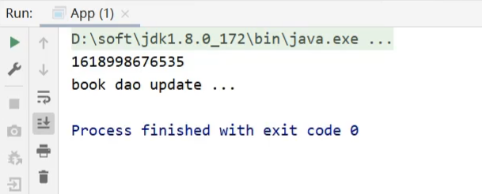

### 知识点1：@EnableAspectJAutoProxy  

| 名称 | @EnableAspectJAutoProxy |
| ---- | ----------------------- |
| 类型 | 配置类注解              |
| 位置 | 配置类定义上方          |
| 作用 | 开启注解格式AOP功能     |

### 知识点2：@Aspect

| 名称 | @Aspect               |
| ---- | --------------------- |
| 类型 | 类注解                |
| 位置 | 切面类定义上方        |
| 作用 | 设置当前类为AOP切面类 |

### 知识点3：@Pointcut   

| 名称 | @Pointcut                   |
| ---- | --------------------------- |
| 类型 | 方法注解                    |
| 位置 | 切入点方法定义上方          |
| 作用 | 设置切入点方法              |
| 属性 | value（默认）：切入点表达式 |

### 知识点4：@Before

| 名称 | @Before                                                      |
| ---- | ------------------------------------------------------------ |
| 类型 | 方法注解                                                     |
| 位置 | 通知方法定义上方                                             |
| 作用 | 设置当前通知方法与切入点之间的绑定关系，当前通知方法在原始切入点方法前运行 |

## 3，AOP工作流程

AOP的入门案例已经完成，对于刚才案例的执行过程，我们就得来分析分析，这一节我们主要讲解两个知识点:`AOP工作流程`和`AOP核心概念`。其中核心概念是对前面核心概念的补充。

### 3.1 AOP工作流程

由于AOP是基于Spring容器管理的bean做的增强，所以整个工作过程需要从Spring加载bean说起:

#### 流程1:Spring容器启动

* 容器启动就需要去加载bean,哪些类需要被加载呢?
* 需要被增强的类，如:BookServiceImpl
* 通知类，如:MyAdvice
* 注意此时bean对象还没有创建成功

#### 流程2:读取所有切面配置中的切入点


* 上面这个例子中有两个切入点的配置，但是第一个`ptx()`并没有被使用，所以不会被读取。

#### 流程3:初始化bean，

判定bean对应的类中的方法是否匹配到任意切入点

* 注意第1步在容器启动的时候，bean对象还没有被创建成功。

* 要被实例化bean对象的类中的方法和切入点进行匹配

  

  * 匹配失败，创建原始对象,如`UserDao`
    * 匹配失败说明不需要增强，直接调用原始对象的方法即可。
  * 匹配成功，创建原始对象（==目标对象==）的==代理==对象,如:`BookDao`
    * 匹配成功说明需要对其进行增强
    * 对哪个类做增强，这个类对应的对象就叫做目标对象
    * 因为要对目标对象进行功能增强，而采用的技术是动态代理，所以会为其创建一个代理对象
    * 最终运行的是代理对象的方法，在该方法中会对原始方法进行功能增强

#### 流程4:获取bean执行方法

* 获取的bean是原始对象时，调用方法并执行，完成操作
* 获取的bean是代理对象时，根据代理对象的运行模式运行原始方法与增强的内容，完成操作

#### 验证容器中是否为代理对象

为了验证IOC容器中创建的对象和我们刚才所说的结论是否一致，首先先把结论理出来:

* 如果目标对象中的方法会被增强，那么容器中将存入的是目标对象的代理对象
* 如果目标对象中的方法不被增强，那么容器中将存入的是目标对象本身。

##### 验证思路

> 1.要执行的方法，不被定义的切入点包含，即不要增强，打印当前类的getClass()方法
>
> 2.要执行的方法，被定义的切入点包含，即要增强，打印出当前类的getClass()方法
>
> 3.观察两次打印的结果

##### 步骤1:修改App类,获取类的类型

```java
public class App {
    public static void main(String[] args) {
        ApplicationContext ctx = new AnnotationConfigApplicationContext(SpringConfig.class);
        BookDao bookDao = ctx.getBean(BookDao.class);
        System.out.println(bookDao);
        System.out.println(bookDao.getClass());
    }
}
```

##### 步骤2:修改MyAdvice类，不增强

因为定义的切入点中，被修改成`update1`,所以BookDao中的update方法在执行的时候，就不会被增强，

所以容器中的对象应该是目标对象本身。

```java
@Component
@Aspect
public class MyAdvice {
    @Pointcut("execution(void com.itheima.dao.BookDao.update1())")
    private void pt(){}
    
    @Before("pt()")
    public void method(){
        System.out.println(System.currentTimeMillis());
    }
}
```

##### 步骤3:运行程序


##### 步骤4:修改MyAdvice类，增强

因为定义的切入点中，被修改成`update`,所以BookDao中的update方法在执行的时候，就会被增强，

所以容器中的对象应该是目标对象的代理对象

```java
@Component
@Aspect
public class MyAdvice {
    @Pointcut("execution(void com.itheima.dao.BookDao.update())")
    private void pt(){}
    
    @Before("pt()")
    public void method(){
        System.out.println(System.currentTimeMillis());
    }
}
```

##### 步骤5:运行程序


至此对于刚才的结论，我们就得到了验证，这块大家需要注意的是:

不能直接打印对象，从上面两次结果中可以看出，直接打印对象走的是对象的toString方法，不管是不是代理对象打印的结果都是一样的，原因是内部对toString方法进行了重写。

### 3.2 AOP核心概念

在上面介绍AOP的工作流程中，我们提到了两个核心概念，分别是:

* 目标对象(Target)：原始功能去掉共性功能对应的类产生的对象，这种对象是无法直接完成最终工作的
* 代理(Proxy)：目标对象无法直接完成工作，需要对其进行功能回填，通过原始对象的代理对象实现

上面这两个概念比较抽象，简单来说，

目标对象就是要增强的类[如:BookServiceImpl类]对应的对象，也叫原始对象，不能说它不能运行，只能说它在运行的过程中对于要增强的内容是缺失的。

SpringAOP是在不改变原有设计(代码)的前提下对其进行增强的，它的底层采用的是代理模式实现的，所以要对原始对象进行增强，就需要对原始对象创建代理对象，在代理对象中的方法把通知[如:MyAdvice中的method方法]内容加进去，就实现了增强,这就是我们所说的代理(Proxy)。

**小结**

通过这一节中，我们需要掌握的内容有：

* 能说出AOP的工作流程
* AOP的核心概念
  * 目标对象、连接点、切入点
  * 通知类、通知
  * 切面
  * 代理
* SpringAOP的本质或者可以说底层实现是通过代理模式。

## 4，AOP配置管理

### 4.1 AOP切入点表达式

前面的案例中，有涉及到如下内容:


对于AOP中切入点表达式，我们总共会学习三个内容，分别是`语法格式`、`通配符`和`书写技巧`。

#### 4.1.1 语法格式

首先我们先要明确两个概念:

* 切入点:要进行增强的方法
* 切入点表达式:要进行增强的方法的描述方式

对于切入点的描述，我们其实是有两中方式的，先来看下前面的例子


描述方式一：执行com.itheima.dao包下的BookDao接口中的无参数update方法

```java
execution(void com.itheima.dao.BookDao.update())
```

描述方式二：执行com.itheima.dao.impl包下的BookDaoImpl类中的无参数update方法

```
execution(void com.itheima.dao.impl.BookDaoImpl.update())
```

因为调用接口方法的时候最终运行的还是其实现类的方法，所以上面两种描述方式都是可以的。

对于切入点表达式的语法为:

* 切入点表达式标准格式：动作关键字(访问修饰符  返回值  包名.类/接口名.方法名(参数) 异常名）

对于这个格式，我们不需要硬记，通过一个例子，理解它:

```
execution(public User com.itheima.service.UserService.findById(int))
```

* execution：动作关键字，描述切入点的行为动作，例如execution表示执行到指定切入点
* public:访问修饰符,还可以是public，private等，可以省略
* User：返回值，写返回值类型
* com.itheima.service：包名，多级包使用点连接
* UserService:类/接口名称
* findById：方法名
* int:参数，直接写参数的类型，多个类型用逗号隔开
* 异常名：方法定义中抛出指定异常，可以省略

切入点表达式就是要找到需要增强的方法，所以它就是对一个具体方法的描述，但是方法的定义会有很多，所以如果每一个方法对应一个切入点表达式，想想这块就会觉得将来编写起来会比较麻烦，有没有更简单的方式呢?

就需要用到下面所学习的通配符。

#### 4.1.2 通配符

我们使用通配符描述切入点，主要的目的就是简化之前的配置，具体都有哪些通配符可以使用?

* `*`:单个独立的任意符号，可以独立出现，也可以作为前缀或者后缀的匹配符出现

  ```
  execution（public * com.itheima.*.UserService.find*(*))
  ```

  匹配com.itheima包下的任意包中的UserService类或接口中所有find开头的带有一个参数的方法

* `..`：多个连续的任意符号，可以独立出现，常用于简化包名与参数的书写

  ```
  execution（public User com..UserService.findById(..))
  ```

  匹配com包下的任意包中的UserService类或接口中所有名称为findById的方法

* `+`：专用于匹配子类类型

  ```
  execution(* *..*Service+.*(..))
  ```

  这个使用率较低，描述子类的，咱们做JavaEE开发，继承机会就一次，使用都很慎重，所以很少用它。*Service+，表示所有以Service结尾的接口的子类。

接下来，我们把案例中使用到的切入点表达式来分析下:

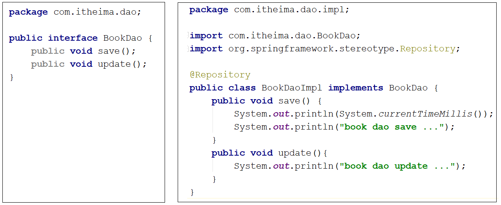

```java
execution(void com.itheima.dao.BookDao.update())
匹配接口，能匹配到
execution(void com.itheima.dao.impl.BookDaoImpl.update())
匹配实现类，能匹配到
execution(* com.itheima.dao.impl.BookDaoImpl.update())
返回值任意，能匹配到
execution(* com.itheima.dao.impl.BookDaoImpl.update(*))
返回值任意，但是update方法必须要有一个参数，无法匹配，要想匹配需要在update接口和实现类添加参数
execution(void com.*.*.*.*.update())
返回值为void,com包下的任意包三层包下的任意类的update方法，匹配到的是实现类，能匹配
execution(void com.*.*.*.update())
返回值为void,com包下的任意两层包下的任意类的update方法，匹配到的是接口，能匹配
execution(void *..update())
返回值为void，方法名是update的任意包下的任意类，能匹配
execution(* *..*(..))
匹配项目中任意类的任意方法，能匹配，但是不建议使用这种方式，影响范围广
execution(* *..u*(..))
匹配项目中任意包任意类下只要以u开头的方法，update方法能满足，能匹配
execution(* *..*e(..))
匹配项目中任意包任意类下只要以e结尾的方法，update和save方法能满足，能匹配
execution(void com..*())
返回值为void，com包下的任意包任意类任意方法，能匹配，*代表的是方法
execution(* com.itheima.*.*Service.find*(..))
将项目中所有业务层方法的以find开头的方法匹配
execution(* com.itheima.*.*Service.save*(..))
将项目中所有业务层方法的以save开头的方法匹配
```

后面两种更符合我们平常切入点表达式的编写规则

#### 4.1.3 书写技巧

对于切入点表达式的编写其实是很灵活的，那么在编写的时候，有没有什么好的技巧让我们用用:

- 所有代码按照标准规范开发，否则以下技巧全部失效
- 描述切入点通**==常描述接口==**，而不描述实现类,如果描述到实现类，就出现紧耦合了
- 访问控制修饰符针对接口开发均采用public描述（**==可省略访问控制修饰符描述==**）
- 返回值类型对于增删改类使用精准类型加速匹配，对于查询类使用\*通配快速描述
- **==包名==**书写**==尽量不使用..匹配==**，效率过低，常用\*做单个包描述匹配，或精准匹配
- **==接口名/类名==**书写名称与模块相关的**==采用\*匹配==**，例如UserService书写成\*Service，绑定业务层接口名
- **==方法名==**书写以**==动词==**进行**==精准匹配==**，名词采用*匹配，例如getById书写成getBy*,selectAll书写成selectAll
- 参数规则较为复杂，根据业务方法灵活调整
- 通常**==不使用异常==**作为**==匹配==**规则

### 4.2 AOP通知类型

前面的案例中，有涉及到如下内容:


它所代表的含义是将`通知`添加到`切入点`方法执行的==前面==。

除了这个注解外，还有没有其他的注解，换个问题就是除了可以在前面加，能不能在其他的地方加?

#### 4.2.1 类型介绍

我们先来回顾下AOP通知:

* AOP通知描述了抽取的共性功能，根据共性功能抽取的位置不同，最终运行代码时要将其加入到合理的位置

通知具体要添加到切入点的哪里?

共提供了5种通知类型:

- 前置通知
- 后置通知
- **==环绕通知(重点)==**
- 返回后通知(了解)
- 抛出异常后通知(了解)

为了更好的理解这几种通知类型，我们来看一张图


(1)前置通知，追加功能到方法执行前,类似于在代码1或者代码2添加内容

(2)后置通知,追加功能到方法执行后,不管方法执行的过程中有没有抛出异常都会执行，类似于在代码5添加内容

(3)返回后通知,追加功能到方法执行后，只有方法正常执行结束后才进行,类似于在代码3添加内容，如果方法执行抛出异常，返回后通知将不会被添加

(4)抛出异常后通知,追加功能到方法抛出异常后，只有方法执行出异常才进行,类似于在代码4添加内容，只有方法抛出异常后才会被添加

(5)环绕通知,环绕通知功能比较强大，它可以追加功能到方法执行的前后，这也是比较常用的方式，它可以实现其他四种通知类型的功能，具体是如何实现的，需要我们往下学习。

#### 4.2.2 环境准备

- 创建一个Maven项目

- pom.xml添加Spring依赖

  ```xml
  <dependencies>
      <dependency>
          <groupId>org.springframework</groupId>
          <artifactId>spring-context</artifactId>
          <version>5.2.10.RELEASE</version>
      </dependency>
      <dependency>
        <groupId>org.aspectj</groupId>
        <artifactId>aspectjweaver</artifactId>
        <version>1.9.4</version>
      </dependency>
  </dependencies>
  ```

- 添加BookDao和BookDaoImpl类

  ```java
  public interface BookDao {
      public void update();
      public int select();
  }
  
  @Repository
  public class BookDaoImpl implements BookDao {
      public void update(){
          System.out.println("book dao update ...");
      }
      public int select() {
          System.out.println("book dao select is running ...");
          return 100;
      }
  }
  ```

- 创建Spring的配置类

  ```java
  @Configuration
  @ComponentScan("com.itheima")
  @EnableAspectJAutoProxy
  public class SpringConfig {
  }
  ```

- 创建通知类

  ```java
  @Component
  @Aspect
  public class MyAdvice {
      @Pointcut("execution(void com.itheima.dao.BookDao.update())")
      private void pt(){}
  
      public void before() {
          System.out.println("before advice ...");
      }
  
      public void after() {
          System.out.println("after advice ...");
      }
  
      public void around(){
          System.out.println("around before advice ...");
          System.out.println("around after advice ...");
      }
  
      public void afterReturning() {
          System.out.println("afterReturning advice ...");
      }
      
      public void afterThrowing() {
          System.out.println("afterThrowing advice ...");
      }
  }
  ```

- 编写App运行类

  ```java
  public class App {
      public static void main(String[] args) {
          ApplicationContext ctx = new AnnotationConfigApplicationContext(SpringConfig.class);
          BookDao bookDao = ctx.getBean(BookDao.class);
          bookDao.update();
      }
  }
  ```

最终创建好的项目结构如下:

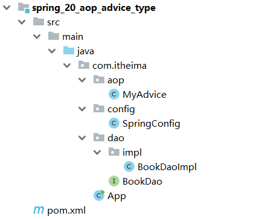

#### 4.2.3 通知类型的使用

##### 前置通知

修改MyAdvice,在before方法上添加`@Before注解`

```java
@Component
@Aspect
public class MyAdvice {
    @Pointcut("execution(void com.itheima.dao.BookDao.update())")
    private void pt(){}
    
    @Before("pt()")
    //此处也可以写成 @Before("MyAdvice.pt()"),不建议
    public void before() {
        System.out.println("before advice ...");
    }
}
```


##### 后置通知

```java
@Component
@Aspect
public class MyAdvice {
    @Pointcut("execution(void com.itheima.dao.BookDao.update())")
    private void pt(){}
    
    @Before("pt()")
    public void before() {
        System.out.println("before advice ...");
    }
    @After("pt()")
    public void after() {
        System.out.println("after advice ...");
    }
}
```


##### 环绕通知

###### 基本使用

```java
@Component
@Aspect
public class MyAdvice {
    @Pointcut("execution(void com.itheima.dao.BookDao.update())")
    private void pt(){}
    
    @Around("pt()")
    public void around(){
        System.out.println("around before advice ...");
        System.out.println("around after advice ...");
    }
}
```


运行结果中，通知的内容打印出来，但是原始方法的内容却没有被执行。

因为环绕通知需要在原始方法的前后进行增强，所以环绕通知就必须要能对原始操作进行调用，具体如何实现?

```java
@Component
@Aspect
public class MyAdvice {
    @Pointcut("execution(void com.itheima.dao.BookDao.update())")
    private void pt(){}
    
    @Around("pt()")
    public void around(ProceedingJoinPoint pjp) throws Throwable{
        System.out.println("around before advice ...");
        //表示对原始操作的调用
        pjp.proceed();
        System.out.println("around after advice ...");
    }
}
```

**说明:**proceed()为什么要抛出异常?

原因很简单，看下源码就知道了

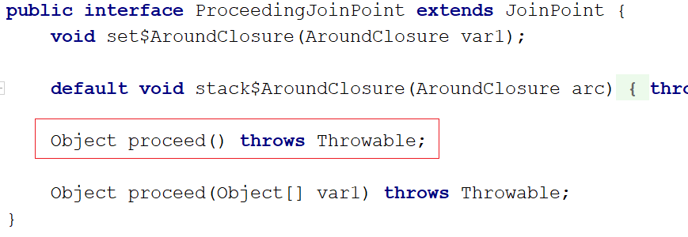

再次运行，程序可以看到原始方法已经被执行了

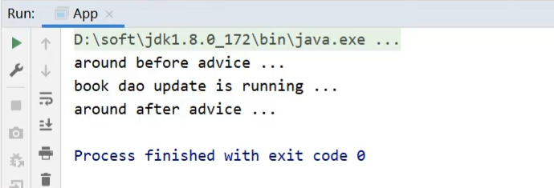

###### 注意事项

(1)原始方法有返回值的处理

* 修改MyAdvice,对BookDao中的select方法添加环绕通知，

```java
@Component
@Aspect
public class MyAdvice {
    @Pointcut("execution(void com.itheima.dao.BookDao.update())")
    private void pt(){}
    
    @Pointcut("execution(int com.itheima.dao.BookDao.select())")
    private void pt2(){}
    
    @Around("pt2()")
    public void aroundSelect(ProceedingJoinPoint pjp) throws Throwable {
        System.out.println("around before advice ...");
        //表示对原始操作的调用
        pjp.proceed();
        System.out.println("around after advice ...");
    }
}
```

* 修改App类，调用select方法

```java
public class App {
    public static void main(String[] args) {
        ApplicationContext ctx = new AnnotationConfigApplicationContext(SpringConfig.class);
        BookDao bookDao = ctx.getBean(BookDao.class);
        int num = bookDao.select();
        System.out.println(num);
    }
}
```

运行后会报错，错误内容为:

Exception in thread "main" org.springframework.aop.AopInvocationException: ==Null return value from advice does not match primitive return type for: public abstract int com.itheima.dao.BookDao.select()==
	at org.springframework.aop.framework.JdkDynamicAopProxy.invoke(JdkDynamicAopProxy.java:226)
	at com.sun.proxy.$Proxy19.select(Unknown Source)
	at com.itheima.App.main(App.java:12)

错误大概的意思是:`空的返回不匹配原始方法的int返回`

* void就是返回Null
* 原始方法就是BookDao下的select方法

所以如果我们使用环绕通知的话，要根据原始方法的返回值来设置环绕通知的返回值，具体解决方案为:

```java
@Component
@Aspect
public class MyAdvice {
    @Pointcut("execution(void com.itheima.dao.BookDao.update())")
    private void pt(){}
    
    @Pointcut("execution(int com.itheima.dao.BookDao.select())")
    private void pt2(){}
    
    @Around("pt2()")
    public Object aroundSelect(ProceedingJoinPoint pjp) throws Throwable {
        System.out.println("around before advice ...");
        //表示对原始操作的调用
        Object ret = pjp.proceed();
        System.out.println("around after advice ...");
        return ret;
    }
}
```

**说明:**

​	为什么返回的是Object而不是int的主要原因是Object类型更通用。

​	在环绕通知中是可以对原始方法返回值就行修改的。

##### 返回后通知

```java
@Component
@Aspect
public class MyAdvice {
    @Pointcut("execution(void com.itheima.dao.BookDao.update())")
    private void pt(){}
    
    @Pointcut("execution(int com.itheima.dao.BookDao.select())")
    private void pt2(){}
    
    @AfterReturning("pt2()")
    public void afterReturning() {
        System.out.println("afterReturning advice ...");
    }
}
```


**注意：**返回后通知是需要在原始方法`select`正常执行后才会被执行，如果`select()`方法执行的过程中出现了异常，那么返回后通知是不会被执行。后置通知是不管原始方法有没有抛出异常都会被执行。这个案例大家下去可以自己练习验证下。

##### 异常后通知

```java
@Component
@Aspect
public class MyAdvice {
    @Pointcut("execution(void com.itheima.dao.BookDao.update())")
    private void pt(){}
    
    @Pointcut("execution(int com.itheima.dao.BookDao.select())")
    private void pt2(){}
    
    @AfterReturning("pt2()")
    public void afterThrowing() {
        System.out.println("afterThrowing advice ...");
    }
}
```


**注意：**异常后通知是需要原始方法抛出异常，可以在`select()`方法中添加一行代码`int i = 1/0`即可。如果没有抛异常，异常后通知将不会被执行。

学习完这5种通知类型，我们来思考下环绕通知是如何实现其他通知类型的功能的?

因为环绕通知是可以控制原始方法执行的，所以我们把增强的代码写在调用原始方法的不同位置就可以实现不同的通知类型的功能，如:


##### 通知类型总结

###### 知识点1：@After

| 名称 | @After                                                       |
| ---- | ------------------------------------------------------------ |
| 类型 | 方法注解                                                     |
| 位置 | 通知方法定义上方                                             |
| 作用 | 设置当前通知方法与切入点之间的绑定关系，当前通知方法在原始切入点方法后运行 |

###### 知识点2：@AfterReturning  

| 名称 | @AfterReturning                                              |
| ---- | ------------------------------------------------------------ |
| 类型 | 方法注解                                                     |
| 位置 | 通知方法定义上方                                             |
| 作用 | 设置当前通知方法与切入点之间绑定关系，当前通知方法在原始切入点方法正常执行完毕后执行 |

###### 知识点3：@AfterThrowing  

| 名称 | @AfterThrowing                                               |
| ---- | ------------------------------------------------------------ |
| 类型 | 方法注解                                                     |
| 位置 | 通知方法定义上方                                             |
| 作用 | 设置当前通知方法与切入点之间绑定关系，当前通知方法在原始切入点方法运行抛出异常后执行 |

###### 知识点4：@Around

| 名称 | @Around                                                      |
| ---- | ------------------------------------------------------------ |
| 类型 | 方法注解                                                     |
| 位置 | 通知方法定义上方                                             |
| 作用 | 设置当前通知方法与切入点之间的绑定关系，当前通知方法在原始切入点方法前后运行 |

==**环绕通知注意事项**==

1. 环绕通知必须依赖形参ProceedingJoinPoint才能实现对原始方法的调用，进而实现原始方法调用前后同时添加通知
2. 通知中如果未使用ProceedingJoinPoint对原始方法进行调用将跳过原始方法的执行
3. 对原始方法的调用可以不接收返回值，通知方法设置成void即可，如果接收返回值，最好设定为Object类型
4. 原始方法的返回值如果是void类型，通知方法的返回值类型可以设置成void,也可以设置成Object
5. 由于无法预知原始方法运行后是否会抛出异常，因此环绕通知方法必须要处理Throwable异常

介绍完这么多种通知类型，具体该选哪一种呢?

我们可以通过一些案例加深下对通知类型的学习。

### 4.3 业务层接口执行效率

#### 4.3.1 需求分析

这个需求也比较简单，前面我们在介绍AOP的时候已经演示过:

* 需求:任意业务层接口执行均可显示其执行效率（执行时长）

这个案例的目的是查看每个业务层执行的时间，这样就可以监控出哪个业务比较耗时，将其查找出来方便优化。

具体实现的思路:

(1) 开始执行方法之前记录一个时间

(2) 执行方法

(3) 执行完方法之后记录一个时间

(4) 用后一个时间减去前一个时间的差值，就是我们需要的结果。

所以要在方法执行的前后添加业务，经过分析我们将采用`环绕通知`。

**说明:**原始方法如果只执行一次，时间太快，两个时间差可能为0，所以我们要执行万次来计算时间差。

#### 4.3.2 环境准备

- 创建一个Maven项目

- pom.xml添加Spring依赖

  ```xml
  <dependencies>
      <dependency>
        <groupId>org.springframework</groupId>
        <artifactId>spring-context</artifactId>
        <version>5.2.10.RELEASE</version>
      </dependency>
      <dependency>
        <groupId>org.springframework</groupId>
        <artifactId>spring-jdbc</artifactId>
        <version>5.2.10.RELEASE</version>
      </dependency>
      <dependency>
        <groupId>org.springframework</groupId>
        <artifactId>spring-test</artifactId>
        <version>5.2.10.RELEASE</version>
      </dependency>
      <dependency>
        <groupId>org.aspectj</groupId>
        <artifactId>aspectjweaver</artifactId>
        <version>1.9.4</version>
      </dependency>
      <dependency>
        <groupId>mysql</groupId>
        <artifactId>mysql-connector-java</artifactId>
        <version>5.1.47</version>
      </dependency>
      <dependency>
        <groupId>com.alibaba</groupId>
        <artifactId>druid</artifactId>
        <version>1.1.16</version>
      </dependency>
      <dependency>
        <groupId>org.mybatis</groupId>
        <artifactId>mybatis</artifactId>
        <version>3.5.6</version>
      </dependency>
      <dependency>
        <groupId>org.mybatis</groupId>
        <artifactId>mybatis-spring</artifactId>
        <version>1.3.0</version>
      </dependency>
      <dependency>
        <groupId>junit</groupId>
        <artifactId>junit</artifactId>
        <version>4.12</version>
        <scope>test</scope>
      </dependency>
    </dependencies>
  ```

- 添加AccountService、AccountServiceImpl、AccountDao与Account类

  ```java
  public interface AccountService {
      void save(Account account);
      void delete(Integer id);
      void update(Account account);
      List<Account> findAll();
      Account findById(Integer id);
  }
  
  @Service
  public class AccountServiceImpl implements AccountService {
  
      @Autowired
      private AccountDao accountDao;
  
      public void save(Account account) {
          accountDao.save(account);
      }
  
      public void update(Account account){
          accountDao.update(account);
      }
  
      public void delete(Integer id) {
          accountDao.delete(id);
      }
  
      public Account findById(Integer id) {
          return accountDao.findById(id);
      }
  
      public List<Account> findAll() {
          return accountDao.findAll();
      }
  }
  public interface AccountDao {
  
      @Insert("insert into tbl_account(name,money)values(#{name},#{money})")
      void save(Account account);
  
      @Delete("delete from tbl_account where id = #{id} ")
      void delete(Integer id);
  
      @Update("update tbl_account set name = #{name} , money = #{money} where id = #{id} ")
      void update(Account account);
  
      @Select("select * from tbl_account")
      List<Account> findAll();
  
      @Select("select * from tbl_account where id = #{id} ")
      Account findById(Integer id);
  }
  
  public class Account implements Serializable {
  
      private Integer id;
      private String name;
      private Double money;
      //setter..getter..toString方法省略
  }
  ```

- resources下提供一个jdbc.properties

  ```properties
  jdbc.driver=com.mysql.jdbc.Driver
  jdbc.url=jdbc:mysql://localhost:3306/spring_db?useSSL=false
  jdbc.username=root
  jdbc.password=root
  ```

- 创建相关配置类

  ```java
  //Spring配置类:SpringConfig
  @Configuration
  @ComponentScan("com.itheima")
  @PropertySource("classpath:jdbc.properties")
  @Import({JdbcConfig.class,MybatisConfig.class})
  public class SpringConfig {
  }
  //JdbcConfig配置类
  public class JdbcConfig {
      @Value("${jdbc.driver}")
      private String driver;
      @Value("${jdbc.url}")
      private String url;
      @Value("${jdbc.username}")
      private String userName;
      @Value("${jdbc.password}")
      private String password;
  
      @Bean
      public DataSource dataSource(){
          DruidDataSource ds = new DruidDataSource();
          ds.setDriverClassName(driver);
          ds.setUrl(url);
          ds.setUsername(userName);
          ds.setPassword(password);
          return ds;
      }
  }
  //MybatisConfig配置类
  public class MybatisConfig {
  
      @Bean
      public SqlSessionFactoryBean sqlSessionFactory(DataSource dataSource){
          SqlSessionFactoryBean ssfb = new SqlSessionFactoryBean();
          ssfb.setTypeAliasesPackage("com.itheima.domain");
          ssfb.setDataSource(dataSource);
          return ssfb;
      }
  
      @Bean
      public MapperScannerConfigurer mapperScannerConfigurer(){
          MapperScannerConfigurer msc = new MapperScannerConfigurer();
          msc.setBasePackage("com.itheima.dao");
          return msc;
      }
  }
  
  ```

- 编写Spring整合Junit的测试类

  ```java
  @RunWith(SpringJUnit4ClassRunner.class)
  @ContextConfiguration(classes = SpringConfig.class)
  public class AccountServiceTestCase {
      @Autowired
      private AccountService accountService;
  
      @Test
      public void testFindById(){
          Account ac = accountService.findById(2);
      }
  
      @Test
      public void testFindAll(){
          List<Account> all = accountService.findAll();
      }
  
  }
  ```

最终创建好的项目结构如下:


#### 4.3.3 功能开发

##### 步骤1:开启SpringAOP的注解功能

在Spring的主配置文件SpringConfig类中添加注解

```java
@EnableAspectJAutoProxy
```

##### 步骤2:创建AOP的通知类

* 该类要被Spring管理，需要添加@Component

* 要标识该类是一个AOP的切面类，需要添加@Aspect
* 配置切入点表达式，需要添加一个方法，并添加@Pointcut

```java
@Component
@Aspect
public class ProjectAdvice {
    //配置业务层的所有方法
    @Pointcut("execution(* com.itheima.service.*Service.*(..))")
    private void servicePt(){}
    
    public void runSpeed(){
        
    } 
}
```

##### 步骤3:添加环绕通知

在runSpeed()方法上添加@Around

```java
@Component
@Aspect
public class ProjectAdvice {
    //配置业务层的所有方法
    @Pointcut("execution(* com.itheima.service.*Service.*(..))")
    private void servicePt(){}
    //@Around("ProjectAdvice.servicePt()") 可以简写为下面的方式
    @Around("servicePt()")
    public Object runSpeed(ProceedingJoinPoint pjp){
        Object ret = pjp.proceed();
        return ret;
    } 
}
```

**注意:**目前并没有做任何增强

##### 步骤4:完成核心业务，记录万次执行的时间

```java
@Component
@Aspect
public class ProjectAdvice {
    //配置业务层的所有方法
    @Pointcut("execution(* com.itheima.service.*Service.*(..))")
    private void servicePt(){}
    //@Around("ProjectAdvice.servicePt()") 可以简写为下面的方式
    @Around("servicePt()")
    public void runSpeed(ProceedingJoinPoint pjp){
        
        long start = System.currentTimeMillis();
        for (int i = 0; i < 10000; i++) {
           pjp.proceed();
        }
        long end = System.currentTimeMillis();
        System.out.println("业务层接口万次执行时间: "+(end-start)+"ms");
    } 
}
```

##### 步骤5:运行单元测试类


**注意:**因为程序每次执行的时长是不一样的，所以运行多次最终的结果是不一样的。

##### 步骤6:程序优化

目前程序所面临的问题是，多个方法一起执行测试的时候，控制台都打印的是:

`业务层接口万次执行时间:xxxms`

我们没有办法区分到底是哪个接口的哪个方法执行的具体时间，具体如何优化?

```java
@Component
@Aspect
public class ProjectAdvice {
    //配置业务层的所有方法
    @Pointcut("execution(* com.itheima.service.*Service.*(..))")
    private void servicePt(){}
    //@Around("ProjectAdvice.servicePt()") 可以简写为下面的方式
    @Around("servicePt()")
    public void runSpeed(ProceedingJoinPoint pjp){
        //获取执行签名信息
        Signature signature = pjp.getSignature();
        //通过签名获取执行操作名称(接口名)
        String className = signature.getDeclaringTypeName();
        //通过签名获取执行操作名称(方法名)
        String methodName = signature.getName();
        
        long start = System.currentTimeMillis();
        for (int i = 0; i < 10000; i++) {
           pjp.proceed();
        }
        long end = System.currentTimeMillis();
        System.out.println("万次执行："+ className+"."+methodName+"---->" +(end-start) + "ms");
    } 
}
```

##### 步骤7:运行单元测试类


==补充说明==

当前测试的接口执行效率仅仅是一个理论值，并不是一次完整的执行过程。

这块只是通过该案例把AOP的使用进行了学习，具体的实际值是有很多因素共同决定的。

### 4.4 AOP通知获取数据

目前我们写AOP仅仅是在原始方法前后追加一些操作，接下来我们要说说AOP中数据相关的内容，我们将从`获取参数`、`获取返回值`和`获取异常`三个方面来研究切入点的相关信息。

前面我们介绍通知类型的时候总共讲了五种，那么对于这五种类型都会有参数，返回值和异常吗?

我们先来一个个分析下:

* 获取切入点方法的参数，所有的通知类型都可以获取参数
  * JoinPoint：适用于前置、后置、返回后、抛出异常后通知
  * ProceedingJoinPoint：适用于环绕通知
* 获取切入点方法返回值，前置和抛出异常后通知是没有返回值，后置通知可有可无，所以不做研究
  * 返回后通知
  * 环绕通知
* 获取切入点方法运行异常信息，前置和返回后通知是不会有，后置通知可有可无，所以不做研究
  * 抛出异常后通知
  * 环绕通知

#### 4.4.1 环境准备

- 创建一个Maven项目

- pom.xml添加Spring依赖

  ```xml
  <dependencies>
      <dependency>
        <groupId>org.springframework</groupId>
        <artifactId>spring-context</artifactId>
        <version>5.2.10.RELEASE</version>
      </dependency>
      <dependency>
        <groupId>org.aspectj</groupId>
        <artifactId>aspectjweaver</artifactId>
        <version>1.9.4</version>
      </dependency>
    </dependencies>
  ```

- 添加BookDao和BookDaoImpl类

  ```java
  public interface BookDao {
      public String findName(int id);
  }
  @Repository
  public class BookDaoImpl implements BookDao {
  
      public String findName(int id) {
          System.out.println("id:"+id);
          return "itcast";
      }
  }
  ```

- 创建Spring的配置类

  ```java
  @Configuration
  @ComponentScan("com.itheima")
  @EnableAspectJAutoProxy
  public class SpringConfig {
  }
  ```

- 编写通知类

  ```java
  @Component
  @Aspect
  public class MyAdvice {
      @Pointcut("execution(* com.itheima.dao.BookDao.findName(..))")
      private void pt(){}
  
      @Before("pt()")
      public void before() {
          System.out.println("before advice ..." );
      }
  
      @After("pt()")
      public void after() {
          System.out.println("after advice ...");
      }
  
      @Around("pt()")
      public Object around() throws Throwable{
          Object ret = pjp.proceed();
          return ret;
      }
      @AfterReturning("pt()")
      public void afterReturning() {
          System.out.println("afterReturning advice ...");
      }
  
  
      @AfterThrowing("pt()")
      public void afterThrowing() {
          System.out.println("afterThrowing advice ...");
      }
  }
  ```

- 编写App运行类

  ```java
  public class App {
      public static void main(String[] args) {
          ApplicationContext ctx = new AnnotationConfigApplicationContext(SpringConfig.class);
          BookDao bookDao = ctx.getBean(BookDao.class);
          String name = bookDao.findName(100);
          System.out.println(name);
      }
  }
  ```

最终创建好的项目结构如下:

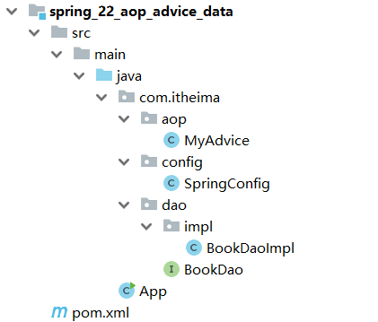

#### 4.4.2 获取参数

##### 非环绕通知获取方式

在方法上添加JoinPoint,通过JoinPoint来获取参数

```java
@Component
@Aspect
public class MyAdvice {
    @Pointcut("execution(* com.itheima.dao.BookDao.findName(..))")
    private void pt(){}

    @Before("pt()")
    public void before(JoinPoint jp) 
        Object[] args = jp.getArgs();
        System.out.println(Arrays.toString(args));
        System.out.println("before advice ..." );
    }
	//...其他的略
}
```

运行App类，可以获取如下内容，说明参数100已经被获取

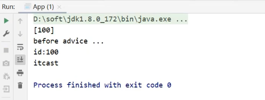

**思考:方法的参数只有一个，为什么获取的是一个数组?**

因为参数的个数是不固定的，所以使用数组更通配些。

如果将参数改成两个会是什么效果呢?

(1)修改BookDao接口和BookDaoImpl实现类

```java
public interface BookDao {
    public String findName(int id,String password);
}
@Repository
public class BookDaoImpl implements BookDao {

    public String findName(int id,String password) {
        System.out.println("id:"+id);
        return "itcast";
    }
}
```

(2)修改App类，调用方法传入多个参数

```java
public class App {
    public static void main(String[] args) {
        ApplicationContext ctx = new AnnotationConfigApplicationContext(SpringConfig.class);
        BookDao bookDao = ctx.getBean(BookDao.class);
        String name = bookDao.findName(100,"itheima");
        System.out.println(name);
    }
}
```

(3)运行App，查看结果,说明两个参数都已经被获取到

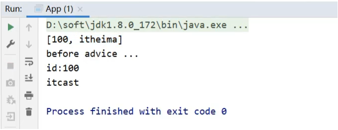

**说明:**

使用JoinPoint的方式获取参数适用于`前置`、`后置`、`返回后`、`抛出异常后`通知。剩下的大家自行去验证。

##### 环绕通知获取方式

环绕通知使用的是ProceedingJoinPoint，因为ProceedingJoinPoint是JoinPoint类的子类，所以对于ProceedingJoinPoint类中应该也会有对应的`getArgs()`方法，我们去验证下:

```java
@Component
@Aspect
public class MyAdvice {
    @Pointcut("execution(* com.itheima.dao.BookDao.findName(..))")
    private void pt(){}

    @Around("pt()")
    public Object around(ProceedingJoinPoint pjp)throws Throwable {
        Object[] args = pjp.getArgs();
        System.out.println(Arrays.toString(args));
        Object ret = pjp.proceed();
        return ret;
    }
	//其他的略
}
```

运行App后查看运行结果，说明ProceedingJoinPoint也是可以通过getArgs()获取参数

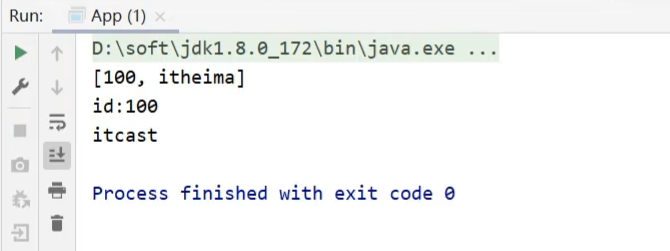

**注意:**

* pjp.proceed()方法是有两个构造方法，分别是:

  

  * 调用无参数的proceed，当原始方法有参数，会在调用的过程中自动传入参数

  * 所以调用这两个方法的任意一个都可以完成功能

  * 但是当需要修改原始方法的参数时，就只能采用带有参数的方法,如下:

    ```java
    @Component
    @Aspect
    public class MyAdvice {
        @Pointcut("execution(* com.itheima.dao.BookDao.findName(..))")
        private void pt(){}
    
        @Around("pt()")
        public Object around(ProceedingJoinPoint pjp) throws Throwable{
            Object[] args = pjp.getArgs();
            System.out.println(Arrays.toString(args));
            args[0] = 666;
            Object ret = pjp.proceed(args);
            return ret;
        }
    	//其他的略
    }
    ```

    有了这个特性后，我们就可以在环绕通知中对原始方法的参数进行拦截过滤，避免由于参数的问题导致程序无法正确运行，保证代码的健壮性。

#### 4.4.3 获取返回值

对于返回值，只有返回后`AfterReturing`和环绕`Around`这两个通知类型可以获取，具体如何获取?

##### 环绕通知获取返回值

```java
@Component
@Aspect
public class MyAdvice {
    @Pointcut("execution(* com.itheima.dao.BookDao.findName(..))")
    private void pt(){}

    @Around("pt()")
    public Object around(ProceedingJoinPoint pjp) throws Throwable{
        Object[] args = pjp.getArgs();
        System.out.println(Arrays.toString(args));
        args[0] = 666;
        Object ret = pjp.proceed(args);
        return ret;
    }
	//其他的略
}
```

上述代码中，`ret`就是方法的返回值，我们是可以直接获取，不但可以获取，如果需要还可以进行修改。

##### 返回后通知获取返回值

```java
@Component
@Aspect
public class MyAdvice {
    @Pointcut("execution(* com.itheima.dao.BookDao.findName(..))")
    private void pt(){}

    @AfterReturning(value = "pt()",returning = "ret")
    public void afterReturning(Object ret) {
        System.out.println("afterReturning advice ..."+ret);
    }
	//其他的略
}
```

==注意:==

(1)参数名的问题


(2)afterReturning方法参数类型的问题

参数类型可以写成String，但是为了能匹配更多的参数类型，建议写成Object类型

(3)afterReturning方法参数的顺序问题


运行App后查看运行结果，说明返回值已经被获取到


#### 4.4.4 获取异常

对于获取抛出的异常，只有抛出异常后`AfterThrowing`和环绕`Around`这两个通知类型可以获取，具体如何获取?

##### 环绕通知获取异常

这块比较简单，以前我们是抛出异常，现在只需要将异常捕获，就可以获取到原始方法的异常信息了

```java
@Component
@Aspect
public class MyAdvice {
    @Pointcut("execution(* com.itheima.dao.BookDao.findName(..))")
    private void pt(){}

    @Around("pt()")
    public Object around(ProceedingJoinPoint pjp){
        Object[] args = pjp.getArgs();
        System.out.println(Arrays.toString(args));
        args[0] = 666;
        Object ret = null;
        try{
            ret = pjp.proceed(args);
        }catch(Throwable throwable){
            t.printStackTrace();
        }
        return ret;
    }
	//其他的略
}
```

在catch方法中就可以获取到异常，至于获取到异常以后该如何处理，这个就和你的业务需求有关了。

##### 抛出异常后通知获取异常

```java
@Component
@Aspect
public class MyAdvice {
    @Pointcut("execution(* com.itheima.dao.BookDao.findName(..))")
    private void pt(){}

    @AfterThrowing(value = "pt()",throwing = "t")
    public void afterThrowing(Throwable t) {
        System.out.println("afterThrowing advice ..."+t);
    }
	//其他的略
}
```

如何让原始方法抛出异常，方式有很多，

```java
@Repository
public class BookDaoImpl implements BookDao {

    public String findName(int id,String password) {
        System.out.println("id:"+id);
        if(true){
            throw new NullPointerException();
        }
        return "itcast";
    }
}
```

==注意:==


运行App后，查看控制台，就能看的异常信息被打印到控制台


至此，AOP通知如何获取数据就已经讲解完了，数据中包含`参数`、`返回值`、`异常(了解)`。

### 4.5 百度网盘密码数据兼容处理

#### 4.5.1 需求分析

需求: 对百度网盘分享链接输入密码时尾部多输入的空格做兼容处理。


问题描述:

* 点击链接，会提示，请输入提取码，如下图所示

  

* 当我们从别人发给我们的内容中复制提取码的时候，有时候会多复制到一些空格，直接粘贴到百度的提取码输入框

* 但是百度那边记录的提取码是没有空格的

* 这个时候如果不做处理，直接对比的话，就会引发提取码不一致，导致无法访问百度盘上的内容

* 所以多输入一个空格可能会导致项目的功能无法正常使用。

* 此时我们就想能不能将输入的参数先帮用户去掉空格再操作呢?

答案是可以的，我们只需要在业务方法执行之前对所有的输入参数进行格式处理——trim()

* 是对所有的参数都需要去除空格么?

也没有必要，一般只需要针对字符串处理即可。

* 以后涉及到需要去除前后空格的业务可能会有很多，这个去空格的代码是每个业务都写么?

可以考虑使用AOP来统一处理。

* AOP有五种通知类型，该使用哪种呢?

我们的需求是将原始方法的参数处理后在参与原始方法的调用，能做这件事的就只有环绕通知。

综上所述，我们需要考虑两件事:
①：在业务方法执行之前对所有的输入参数进行格式处理——trim()
②：使用处理后的参数调用原始方法——环绕通知中存在对原始方法的调用

#### 4.5.2 环境准备

- 创建一个Maven项目

- pom.xml添加Spring依赖

  ```xml
  <dependencies>
      <dependency>
        <groupId>org.springframework</groupId>
        <artifactId>spring-context</artifactId>
        <version>5.2.10.RELEASE</version>
      </dependency>
      <dependency>
        <groupId>org.aspectj</groupId>
        <artifactId>aspectjweaver</artifactId>
        <version>1.9.4</version>
      </dependency>
    </dependencies>
  ```

- 添加ResourcesService，ResourcesServiceImpl,ResourcesDao和ResourcesDaoImpl类

  ```java
  public interface ResourcesDao {
      boolean readResources(String url, String password);
  }
  @Repository
  public class ResourcesDaoImpl implements ResourcesDao {
      public boolean readResources(String url, String password) {
          //模拟校验
          return password.equals("root");
      }
  }
  public interface ResourcesService {
      public boolean openURL(String url ,String password);
  }
  @Service
  public class ResourcesServiceImpl implements ResourcesService {
      @Autowired
      private ResourcesDao resourcesDao;
  
      public boolean openURL(String url, String password) {
          return resourcesDao.readResources(url,password);
      }
  }
  
  ```

- 创建Spring的配置类

  ```java
  @Configuration
  @ComponentScan("com.itheima")
  public class SpringConfig {
  }
  ```

- 编写App运行类

  ```java
  public class App {
      public static void main(String[] args) {
          ApplicationContext ctx = new AnnotationConfigApplicationContext(SpringConfig.class);
          ResourcesService resourcesService = ctx.getBean(ResourcesService.class);
          boolean flag = resourcesService.openURL("http://pan.baidu.com/haha", "root");
          System.out.println(flag);
      }
  }
  ```

最终创建好的项目结构如下:

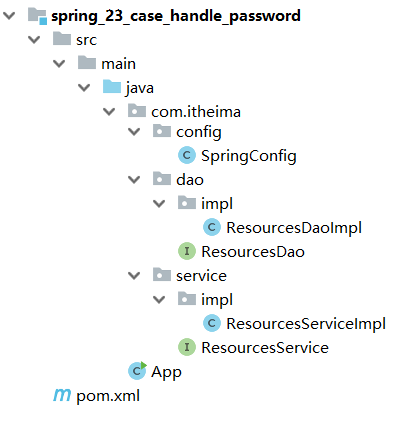

现在项目的效果是，当输入密码为"root"控制台打印为true,如果密码改为"root  "控制台打印的是false

需求是使用AOP将参数进行统一处理，不管输入的密码`root`前后包含多少个空格，最终控制台打印的都是true。

#### 4.5.3 具体实现

##### 步骤1:开启SpringAOP的注解功能

```java
@Configuration
@ComponentScan("com.itheima")
@EnableAspectJAutoProxy
public class SpringConfig {
}
```

##### 步骤2:编写通知类

```java
@Component
@Aspect
public class DataAdvice {
    @Pointcut("execution(boolean com.itheima.service.*Service.*(*,*))")
    private void servicePt(){}
    
}
```

##### 步骤3:添加环绕通知

```java
@Component
@Aspect
public class DataAdvice {
    @Pointcut("execution(boolean com.itheima.service.*Service.*(*,*))")
    private void servicePt(){}
    
    @Around("DataAdvice.servicePt()")
    // @Around("servicePt()")这两种写法都对
    public Object trimStr(ProceedingJoinPoint pjp) throws Throwable {
        Object ret = pjp.proceed();
        return ret;
    }
    
}
```

##### 步骤4:完成核心业务，处理参数中的空格

```java
@Component
@Aspect
public class DataAdvice {
    @Pointcut("execution(boolean com.itheima.service.*Service.*(*,*))")
    private void servicePt(){}
    
    @Around("DataAdvice.servicePt()")
    // @Around("servicePt()")这两种写法都对
    public Object trimStr(ProceedingJoinPoint pjp) throws Throwable {
        //获取原始方法的参数
        Object[] args = pjp.getArgs();
        for (int i = 0; i < args.length; i++) {
            //判断参数是不是字符串
            if(args[i].getClass().equals(String.class)){
                args[i] = args[i].toString().trim();
            }
        }
        //将修改后的参数传入到原始方法的执行中
        Object ret = pjp.proceed(args);
        return ret;
    }
    
}
```

##### 步骤5:运行程序

不管密码`root`前后是否加空格，最终控制台打印的都是true

##### 步骤6:优化测试

为了能更好的看出AOP已经生效，我们可以修改ResourcesImpl类，在方法中将密码的长度进行打印

```java
@Repository
public class ResourcesDaoImpl implements ResourcesDao {
    public boolean readResources(String url, String password) {
        System.out.println(password.length());
        //模拟校验
        return password.equals("root");
    }
}
```

再次运行成功，就可以根据最终打印的长度来看看，字符串的空格有没有被去除掉。

**注意：**


## 5，AOP总结

AOP的知识就已经讲解完了，接下来对于AOP的知识进行一个总结:

### 5.1 AOP的核心概念

* 概念：AOP(Aspect Oriented Programming)面向切面编程，一种编程范式
* 作用：在不惊动原始设计的基础上为方法进行功能==增强==
* 核心概念
  * 代理（Proxy）：SpringAOP的核心本质是采用代理模式实现的
  * 连接点（JoinPoint）：在SpringAOP中，理解为任意方法的执行
  * 切入点（Pointcut）：匹配连接点的式子，也是具有共性功能的方法描述
  * 通知（Advice）：若干个方法的共性功能，在切入点处执行，最终体现为一个方法
  * 切面（Aspect）：描述通知与切入点的对应关系
  * 目标对象（Target）：被代理的原始对象成为目标对象

### 5.2 切入点表达式

* 切入点表达式标准格式：动作关键字(访问修饰符  返回值  包名.类/接口名.方法名（参数）异常名)

  ```
  execution(* com.itheima.service.*Service.*(..))
  ```

* 切入点表达式描述通配符：

  * 作用：用于快速描述，范围描述
  * `*`：匹配任意符号（常用）
  * `..` ：匹配多个连续的任意符号（常用）
  * `+`：匹配子类类型

* 切入点表达式书写技巧

  1.按==标准规范==开发
  2.查询操作的返回值建议使用\*匹配
  3.减少使用..的形式描述包
  4.==对接口进行描述==，使用\*表示模块名，例如UserService的匹配描述为*Service
  5.方法名书写保留动词，例如get，使用\*表示名词，例如getById匹配描述为getBy\*
  6.参数根据实际情况灵活调整

### 5.3 五种通知类型

- 前置通知
- 后置通知
- 环绕通知（重点）
  - 环绕通知依赖形参ProceedingJoinPoint才能实现对原始方法的调用
  - 环绕通知可以隔离原始方法的调用执行
  - 环绕通知返回值设置为Object类型
  - 环绕通知中可以对原始方法调用过程中出现的异常进行处理
- 返回后通知
- 抛出异常后通知

### 5.4 通知中获取参数

- 获取切入点方法的参数，所有的通知类型都可以获取参数
  - JoinPoint：适用于前置、后置、返回后、抛出异常后通知
  - ProceedingJoinPoint：适用于环绕通知
- 获取切入点方法返回值，前置和抛出异常后通知是没有返回值，后置通知可有可无，所以不做研究
  - 返回后通知
  - 环绕通知
- 获取切入点方法运行异常信息，前置和返回后通知是不会有，后置通知可有可无，所以不做研究
  - 抛出异常后通知
  - 环绕通知

## 6，AOP事务管理

### 6.1 Spring事务简介

#### 6.1.1 相关概念介绍

- 事务作用：在数据层保障一系列的数据库操作同成功同失败
- Spring事务作用：在数据层或**==业务层==**保障一系列的数据库操作同成功同失败

数据层有事务我们可以理解，为什么业务层也需要处理事务呢?

举个简单的例子，

* 转账业务会有两次数据层的调用，一次是加钱一次是减钱
* 把事务放在数据层，加钱和减钱就有两个事务
* 没办法保证加钱和减钱同时成功或者同时失败
* 这个时候就需要将事务放在业务层进行处理。

Spring为了管理事务，提供了一个平台事务管理器`PlatformTransactionManager`


commit是用来提交事务，rollback是用来回滚事务。

PlatformTransactionManager只是一个接口，Spring还为其提供了一个具体的实现:


从名称上可以看出，我们只需要给它一个DataSource对象，它就可以帮你去在业务层管理事务。其内部采用的是JDBC的事务。所以说如果你持久层采用的是JDBC相关的技术，就可以采用这个事务管理器来管理你的事务。而Mybatis内部采用的就是JDBC的事务，所以后期我们Spring整合Mybatis就采用的这个DataSourceTransactionManager事务管理器。

#### 6.1.2 转账案例-需求分析

接下来通过一个案例来学习下Spring是如何来管理事务的。

先来分析下需求:

需求: 实现任意两个账户间转账操作

需求微缩: A账户减钱，B账户加钱

为了实现上述的业务需求，我们可以按照下面步骤来实现下:
①：数据层提供基础操作，指定账户减钱（outMoney），指定账户加钱（inMoney）

②：业务层提供转账操作（transfer），调用减钱与加钱的操作

③：提供2个账号和操作金额执行转账操作

④：基于Spring整合MyBatis环境搭建上述操作

#### 6.1.3 转账案例-环境搭建

##### 步骤1:准备数据库表

之前我们在整合Mybatis的时候已经创建了这个表,可以直接使用

```sql
create database spring_db character set utf8;
use spring_db;
create table tbl_account(
    id int primary key auto_increment,
    name varchar(35),
    money double
);
insert into tbl_account values(1,'Tom',1000);
insert into tbl_account values(2,'Jerry',1000);
```

##### 步骤2:创建项目导入jar包

项目的pom.xml添加相关依赖

```xml
<dependencies>
    <dependency>
      <groupId>org.springframework</groupId>
      <artifactId>spring-context</artifactId>
      <version>5.2.10.RELEASE</version>
    </dependency>
    <dependency>
      <groupId>com.alibaba</groupId>
      <artifactId>druid</artifactId>
      <version>1.1.16</version>
    </dependency>

    <dependency>
      <groupId>org.mybatis</groupId>
      <artifactId>mybatis</artifactId>
      <version>3.5.6</version>
    </dependency>

    <dependency>
      <groupId>mysql</groupId>
      <artifactId>mysql-connector-java</artifactId>
      <version>5.1.47</version>
    </dependency>

    <dependency>
      <groupId>org.springframework</groupId>
      <artifactId>spring-jdbc</artifactId>
      <version>5.2.10.RELEASE</version>
    </dependency>

    <dependency>
      <groupId>org.mybatis</groupId>
      <artifactId>mybatis-spring</artifactId>
      <version>1.3.0</version>
    </dependency>

    <dependency>
      <groupId>junit</groupId>
      <artifactId>junit</artifactId>
      <version>4.12</version>
      <scope>test</scope>
    </dependency>

    <dependency>
      <groupId>org.springframework</groupId>
      <artifactId>spring-test</artifactId>
      <version>5.2.10.RELEASE</version>
    </dependency>

  </dependencies>
```

##### 步骤3:根据表创建模型类

```java
public class Account implements Serializable {

    private Integer id;
    private String name;
    private Double money;
	//setter...getter...toString...方法略    
}
```

##### 步骤4:创建Dao接口

```java
public interface AccountDao {

    @Update("update tbl_account set money = money + #{money} where name = #{name}")
    void inMoney(@Param("name") String name, @Param("money") Double money);

    @Update("update tbl_account set money = money - #{money} where name = #{name}")
    void outMoney(@Param("name") String name, @Param("money") Double money);
}
```

##### 步骤5:创建Service接口和实现类

```java
public interface AccountService {
    /**
     * 转账操作
     * @param out 传出方
     * @param in 转入方
     * @param money 金额
     */
    public void transfer(String out,String in ,Double money) ;
}

@Service
public class AccountServiceImpl implements AccountService {

    @Autowired
    private AccountDao accountDao;

    public void transfer(String out,String in ,Double money) {
        accountDao.outMoney(out,money);
        accountDao.inMoney(in,money);
    }

}
```

##### 步骤6:添加jdbc.properties文件

```properties
jdbc.driver=com.mysql.jdbc.Driver
jdbc.url=jdbc:mysql://localhost:3306/spring_db?useSSL=false
jdbc.username=root
jdbc.password=root
```

##### 步骤7:创建JdbcConfig配置类

```java
public class JdbcConfig {
    @Value("${jdbc.driver}")
    private String driver;
    @Value("${jdbc.url}")
    private String url;
    @Value("${jdbc.username}")
    private String userName;
    @Value("${jdbc.password}")
    private String password;

    @Bean
    public DataSource dataSource(){
        DruidDataSource ds = new DruidDataSource();
        ds.setDriverClassName(driver);
        ds.setUrl(url);
        ds.setUsername(userName);
        ds.setPassword(password);
        return ds;
    }
}
```

##### 步骤8:创建MybatisConfig配置类

```java
public class MybatisConfig {

    @Bean
    public SqlSessionFactoryBean sqlSessionFactory(DataSource dataSource){
        SqlSessionFactoryBean ssfb = new SqlSessionFactoryBean();
        ssfb.setTypeAliasesPackage("com.itheima.domain");
        ssfb.setDataSource(dataSource);
        return ssfb;
    }

    @Bean
    public MapperScannerConfigurer mapperScannerConfigurer(){
        MapperScannerConfigurer msc = new MapperScannerConfigurer();
        msc.setBasePackage("com.itheima.dao");
        return msc;
    }
}
```

##### 步骤9:创建SpringConfig配置类

```java
@Configuration
@ComponentScan("com.itheima")
@PropertySource("classpath:jdbc.properties")
@Import({JdbcConfig.class,MybatisConfig.class})
public class SpringConfig {
}

```

##### 步骤10:编写测试类

```java
@RunWith(SpringJUnit4ClassRunner.class)
@ContextConfiguration(classes = SpringConfig.class)
public class AccountServiceTest {

    @Autowired
    private AccountService accountService;

    @Test
    public void testTransfer() throws IOException {
        accountService.transfer("Tom","Jerry",100D);
    }

}
```

最终创建好的项目结构如下:


#### 6.1.4 事务管理

上述环境，运行单元测试类，会执行转账操作，`Tom`的账户会减少100，`Jerry`的账户会加100。

这是正常情况下的运行结果，但是如果在转账的过程中出现了异常，如:

```java
@Service
public class AccountServiceImpl implements AccountService {

    @Autowired
    private AccountDao accountDao;

    public void transfer(String out,String in ,Double money) {
        accountDao.outMoney(out,money);
        int i = 1/0;
        accountDao.inMoney(in,money);
    }

}
```

这个时候就模拟了转账过程中出现异常的情况，正确的操作应该是转账出问题了，`Tom`应该还是900，`Jerry`应该还是1100，但是真正运行后会发现，并没有像我们想象的那样，`Tom`账户为800而`Jerry`还是1100,100块钱凭空消息了，银行乐疯了。如果把转账换个顺序，银行就该哭了。

不管哪种情况，都是不允许出现的，对刚才的结果我们做一个分析:

①：程序正常执行时，账户金额A减B加，没有问题

②：程序出现异常后，转账失败，但是异常之前操作成功，异常之后操作失败，整体业务失败

当程序出问题后，我们需要让事务进行回滚，而且这个事务应该是加在业务层上，而Spring的事务管理就是用来解决这类问题的。

Spring事务管理具体的实现步骤为:

##### 步骤1:在需要被事务管理的方法上添加注解

```java
public interface AccountService {
    /**
     * 转账操作
     * @param out 传出方
     * @param in 转入方
     * @param money 金额
     */
    //配置当前接口方法具有事务
    public void transfer(String out,String in ,Double money) ;
}

@Service
public class AccountServiceImpl implements AccountService {

    @Autowired
    private AccountDao accountDao;
	@Transactional
    public void transfer(String out,String in ,Double money) {
        accountDao.outMoney(out,money);
        int i = 1/0;
        accountDao.inMoney(in,money);
    }

}
```

==注意:==

@Transactional可以写在接口类上、接口方法上、实现类上和实现类方法上

* 写在接口类上，该接口的所有实现类的所有方法都会有事务
* 写在接口方法上，该接口的所有实现类的该方法都会有事务
* 写在实现类上，该类中的所有方法都会有事务
* 写在实现类方法上，该方法上有事务
* ==建议写在实现类或实现类的方法上==

##### 步骤2:在JdbcConfig类中配置事务管理器

```java
public class JdbcConfig {
    @Value("${jdbc.driver}")
    private String driver;
    @Value("${jdbc.url}")
    private String url;
    @Value("${jdbc.username}")
    private String userName;
    @Value("${jdbc.password}")
    private String password;

    @Bean
    public DataSource dataSource(){
        DruidDataSource ds = new DruidDataSource();
        ds.setDriverClassName(driver);
        ds.setUrl(url);
        ds.setUsername(userName);
        ds.setPassword(password);
        return ds;
    }

    //配置事务管理器，mybatis使用的是jdbc事务
    @Bean
    public PlatformTransactionManager transactionManager(DataSource dataSource){
        DataSourceTransactionManager transactionManager = new DataSourceTransactionManager();
        transactionManager.setDataSource(dataSource);
        return transactionManager;
    }
}
```

**注意：**事务管理器要根据使用技术进行选择，Mybatis框架使用的是JDBC事务，可以直接使用`DataSourceTransactionManager`

##### 步骤3：开启事务注解

在SpringConfig的配置类中开启

```java
@Configuration
@ComponentScan("com.itheima")
@PropertySource("classpath:jdbc.properties")
@Import({JdbcConfig.class,MybatisConfig.class
//开启注解式事务驱动
@EnableTransactionManagement
public class SpringConfig {
}

```

##### 步骤4:运行测试类

会发现在转换的业务出现错误后，事务就可以控制回顾，保证数据的正确性。

##### 知识点1：@EnableTransactionManagement

| 名称 | @EnableTransactionManagement           |
| ---- | -------------------------------------- |
| 类型 | 配置类注解                             |
| 位置 | 配置类定义上方                         |
| 作用 | 设置当前Spring环境中开启注解式事务支持 |

##### 知识点2：@Transactional   

| 名称 | @Transactional                                               |
| ---- | ------------------------------------------------------------ |
| 类型 | 接口注解  类注解  方法注解                                   |
| 位置 | 业务层接口上方  业务层实现类上方  业务方法上方               |
| 作用 | 为当前业务层方法添加事务（如果设置在类或接口上方则类或接口中所有方法均添加事务） |

### 6.2 Spring事务角色

这节中我们重点要理解两个概念，分别是`事务管理员`和`事务协调员`。

1. 未开启Spring事务之前:


* AccountDao的outMoney因为是修改操作，会开启一个事务T1
* AccountDao的inMoney因为是修改操作，会开启一个事务T2
* AccountService的transfer没有事务，
  * 运行过程中如果没有抛出异常，则T1和T2都正常提交，数据正确
  * 如果在两个方法中间抛出异常，T1因为执行成功提交事务，T2因为抛异常不会被执行
  * 就会导致数据出现错误

2. 开启Spring的事务管理后

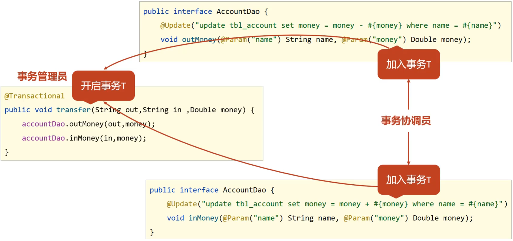

* transfer上添加了@Transactional注解，在该方法上就会有一个事务T
* AccountDao的outMoney方法的事务T1加入到transfer的事务T中
* AccountDao的inMoney方法的事务T2加入到transfer的事务T中
* 这样就保证他们在同一个事务中，当业务层中出现异常，整个事务就会回滚，保证数据的准确性。

通过上面例子的分析，我们就可以得到如下概念:


- 事务管理员：发起事务方，在Spring中通常指代业务层开启事务的方法
- 事务协调员：加入事务方，在Spring中通常指代数据层方法，也可以是业务层方法

==注意:==

目前的事务管理是基于`DataSourceTransactionManager`和`SqlSessionFactoryBean`使用的是同一个数据源。

### 6.3 Spring事务属性

上一节我们介绍了两个概念，事务的管理员和事务的协同员，对于这两个概念具体做什么的，我们待会通过案例来使用下。除了这两个概念，还有就是事务的其他相关配置都有哪些，就是我们接下来要学习的内容。

在这一节中，我们主要学习三部分内容`事务配置`、`转账业务追加日志`、`事务传播行为`。

#### 6.3.1 事务配置


上面这些属性都可以在`@Transactional`注解的参数上进行设置。

* readOnly：true只读事务，false读写事务，增删改要设为false,查询设为true。

* timeout:设置超时时间单位秒，在多长时间之内事务没有提交成功就自动回滚，-1表示不设置超时时间。

* rollbackFor:当出现指定异常进行事务回滚

* noRollbackFor:当出现指定异常不进行事务回滚

  * 思考:出现异常事务会自动回滚，这个是我们之前就已经知道的

  * noRollbackFor是设定对于指定的异常不回滚，这个好理解

  * rollbackFor是指定回滚异常，对于异常事务不应该都回滚么，为什么还要指定?

    * 这块需要更正一个知识点，并不是所有的异常都会回滚事务，比如下面的代码就不会回滚

      ```java
      public interface AccountService {
          /**
           * 转账操作
           * @param out 传出方
           * @param in 转入方
           * @param money 金额
           */
          //配置当前接口方法具有事务
          public void transfer(String out,String in ,Double money) throws IOException;
      }
      
      @Service
      public class AccountServiceImpl implements AccountService {
      
          @Autowired
          private AccountDao accountDao;
      	@Transactional
          public void transfer(String out,String in ,Double money) throws IOException{
              accountDao.outMoney(out,money);
              //int i = 1/0; //这个异常事务会回滚
              if(true){
                  throw new IOException(); //这个异常事务就不会回滚
              }
              accountDao.inMoney(in,money);
          }
      
      }
      ```

* 出现这个问题的原因是，Spring的事务只会对`Error异常`和`RuntimeException异常`及其子类进行事务回顾，其他的异常类型是不会回滚的，对应IOException不符合上述条件所以不回滚
      

  * 此时就可以使用rollbackFor属性来设置出现IOException异常不回滚

    ```java
    @Service
    public class AccountServiceImpl implements AccountService {
    
        @Autowired
        private AccountDao accountDao;
    	 @Transactional(rollbackFor = {IOException.class})
        public void transfer(String out,String in ,Double money) throws IOException{
            accountDao.outMoney(out,money);
            //int i = 1/0; //这个异常事务会回滚
            if(true){
                throw new IOException(); //这个异常事务就不会回滚
            }
            accountDao.inMoney(in,money);
        }
    
    }
    ```

* rollbackForClassName等同于rollbackFor,只不过属性为异常的类全名字符串

* noRollbackForClassName等同于noRollbackFor，只不过属性为异常的类全名字符串

* isolation设置事务的隔离级别

  * DEFAULT   :默认隔离级别, 会采用数据库的隔离级别
  * READ_UNCOMMITTED : 读未提交
  * READ_COMMITTED : 读已提交
  * REPEATABLE_READ : 重复读取
  * SERIALIZABLE: 串行化

介绍完上述属性后，还有最后一个事务的传播行为，为了讲解该属性的设置，我们需要完成下面的案例。


#### 6.3.2 转账业务追加日志案例

##### 6.3.2.1 需求分析

在前面的转案例的基础上添加新的需求，完成转账后记录日志。

- 需求：实现任意两个账户间转账操作，并对每次转账操作在数据库进行留痕
- 需求微缩：A账户减钱，B账户加钱，数据库记录日志

基于上述的业务需求，我们来分析下该如何实现:

①：基于转账操作案例添加日志模块，实现数据库中记录日志

②：业务层转账操作（transfer），调用减钱、加钱与记录日志功能

需要注意一点就是，我们这个案例的预期效果为:

==无论转账操作是否成功，均进行转账操作的日志留痕==

##### 6.3.2.2 环境准备

该环境是基于转账环境来完成的，所以环境的准备可以参考`6.1.3的环境搭建步骤`，在其基础上，我们继续往下写

###### 步骤1:创建日志表

```sql
create table tbl_log(
   id int primary key auto_increment,
   info varchar(255),
   createDate datetime
)
```

###### 步骤2:添加LogDao接口

```java
public interface LogDao {
    @Insert("insert into tbl_log (info,createDate) values(#{info},now())")
    void log(String info);
}

```

###### 步骤3:添加LogService接口与实现类

```java
public interface LogService {
    void log(String out, String in, Double money);
}
@Service
public class LogServiceImpl implements LogService {

    @Autowired
    private LogDao logDao;
	@Transactional
    public void log(String out,String in,Double money ) {
        logDao.log("转账操作由"+out+"到"+in+",金额："+money);
    }
}
```

###### 步骤4:在转账的业务中添加记录日志

```java
public interface AccountService {
    /**
     * 转账操作
     * @param out 传出方
     * @param in 转入方
     * @param money 金额
     */
    //配置当前接口方法具有事务
    public void transfer(String out,String in ,Double money)throws IOException ;
}
@Service
public class AccountServiceImpl implements AccountService {

    @Autowired
    private AccountDao accountDao;
    @Autowired
    private LogService logService;
	@Transactional
    public void transfer(String out,String in ,Double money) {
        try{
            accountDao.outMoney(out,money);
            accountDao.inMoney(in,money);
        }finally {
            logService.log(out,in,money);
        }
    }

}
```

###### 步骤5:运行程序

* 当程序正常运行，tbl_account表中转账成功，tbl_log表中日志记录成功

* 当转账业务之间出现异常(int i =1/0),转账失败，tbl_account成功回滚，但是tbl_log表未添加数据
* 这个结果和我们想要的不一样，什么原因?该如何解决?
* 失败原因:日志的记录与转账操作隶属同一个事务，同成功同失败
* 最终效果:无论转账操作是否成功，日志必须保留

#### 6.3.3 事务传播行为


对于上述案例的分析:

* log方法、inMoney方法和outMoney方法都属于增删改，分别有事务T1,T2,T3
* transfer因为加了@Transactional注解，也开启了事务T
* 前面我们讲过Spring事务会把T1,T2,T3都加入到事务T中
* 所以当转账失败后，所有的事务都回滚，导致日志没有记录下来
* 这和我们的需求不符，这个时候我们就想能不能让log方法单独是一个事务呢?

要想解决这个问题，就需要用到事务传播行为，所谓的事务传播行为指的是:

事务传播行为：事务协调员对事务管理员所携带事务的处理态度。

具体如何解决，就需要用到之前我们没有说的`propagation属性`。

##### 1.修改logService改变事务的传播行为

```java
@Service
public class LogServiceImpl implements LogService {

    @Autowired
    private LogDao logDao;
	//propagation设置事务属性：传播行为设置为当前操作需要新事务
    @Transactional(propagation = Propagation.REQUIRES_NEW)
    public void log(String out,String in,Double money ) {
        logDao.log("转账操作由"+out+"到"+in+",金额："+money);
    }
}
```

运行后，就能实现我们想要的结果，不管转账是否成功，都会记录日志。

##### 2.事务传播行为的可选值


对于我们开发实际中使用的话，因为默认值需要事务是常态的。根据开发过程选择其他的就可以了，例如案例中需要新事务就需要手工配置。其实入账和出账操作上也有事务，采用的就是默认值。