# 一、写在前面

## 1. 不同博客类型的选择

目前搭建个人网站主要有两种选择：

- 动态网站：通常包括前端和后端两个部分，是通过数据库进行架构的网站，用户访问时网站会从数据库中提取信息并实时变更网站内容。这种网站通常利于维护、可交互性强，功能相对强大，但网站本身更加臃肿，用户访问时网页的打开速度也较慢。主流的动态博客框架有Wordpress、Typecho等。
- 静态网站：指全部通过html代码格式页面组成、所有内容都保存在html页面中的网站。可维护性较差，修改网页内容需要重新生存html页面，但访问速度极快、简洁、轻量。主流静态博客框架有Hexo、Hugo等。


部署方式也主要有两种选择：

- 托管至Github Pages上：借用Github的这一功能部署网站，操作简单、免费，但国内访问速度较慢，且无法被百度爬虫爬取收录。
- 部署至自己的云服务器上：需要花钱购买服务器、域名，但自主性强，可以随意折腾。

在这里，我选择了Hexo+部署至腾讯云服务器的方式来完成我的博客网站的搭建，本文也会记录我从零开始搭建博客的过程。

## 2. Hexo简介

Hexo是一个基于Node.js的简洁、快速的轻量级博客框架，支持Markdown，可以很方便地解析Markdown语言并渲染生成静态网页。此外，Hexo的用户相对较多，在搜索引擎上能搜索到很多支持文章及第三方插件，便于快速定位各种问题，想美化、拓展自己的网页也很容易。

> Node.js：一种脚本语言，可以简单地理解为运行在服务器端的JavaScript，常用于web开发。
>
> Markdown：一种轻量级标记语言，后续我们博客内容的书写都会用到markdown，介绍及教程在[这里](https://www.runoob.com/markdown/md-tutorial.html)。

## 3. 搭建博客前的准备

开始前，你需要购买一台云服务器，并注册好用于博客网站的域名。我选择了腾讯云的轻量应用服务器（2核2G 4M带宽）并预装了CentOS 8.2的系统镜像，用于搭建博客这类轻型网站性能完全足够。我这里购买服务器用了45元/年的首单特惠，过期后还可以使用腾讯云的学生优惠来续费，大概也是100元左右一年，对于大部分学生来说也还算负担得起。

其次，还需要注册好自己的域名并完成实名认证，我是在阿里云的万网注册了 `www.glimound.com` 这个域名，费用是63元/年，供大家参考。通常，非.com后缀的域名会更加便宜，但需要注意的是，**只有在[工信部域名行业管理信息公示网站](http://xn--eqrt2g.xn--vuq861b/#)上展示的域名后缀才可进行后续的ICP备案**，而未进行备案的域名解析至国内的服务器后将无法正常访问。

# 二、工作原理


了解整个博客架构的工作原理有助于理解下面各个步骤的意义。我们需要在本地安装Hexo程序，并在本地hexo目录内书写博客。书写的博客将会保存在source目录内，当我们输入 `hexo generate` 命令时，hexo将会把我们写的markdown文件渲染成静态文件（即网页文件）；输入 `hexo deploy` 时，hexo会通过我们配置好的免密登录连接至服务器，并将生成的静态文件推送到服务器的Git仓库内。Git仓库内容的变更触发钩子文件，将仓库内的内容部署至网站根目录下。

同时，我们还需要配置好nginx服务和域名解析。当用户访问我们博客的域名时，域名将被重定向为服务器的ip地址，并通过nginx服务访问网站根目录里的静态文件。

> Git：一个版本管理系统，可供开发者方便地管理不同版本的代码。
>
> nginx：一个HTTP和反向代理web服务器，本文中我们用到反向代理功能，用户通过该功能以访问服务器内的资源。

# 三、搭建步骤

## 1. 本地配置（Win10）

开始搭建网站前，需要先在本地计算机安装hexo与其所需的相关环境。注意，**以下步骤全部在本地计算机上完成**。

### 1.1 安装Git

前往[官网](https://git-scm.com/)下载较新版本的Git并安装，安装时的各种选项默认即可，或根据自己的需要进行调整。安装完成后右键桌面空白处会多出”Git GUI Here”和”Git Bash Here”两个选项，如图所示。

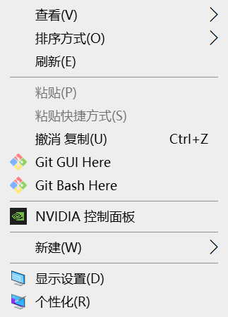

打开Git Bash，依次输入以下命令。

```
git config --global user.email "xxx@xxx.com"     # xxx@xxx.com改为你的邮箱
git config --global user.name "xxx"      # xxx改为你的昵称
```

这两条命令修改了Git配置文件中用户的邮箱和名称，每一个Git提交都会使用这些信息。无需担心，这里的邮箱和名称只用于标识。

### 1.2 安装Node.js和npm

前往[官网](https://nodejs.org/)下载较新的LTS（即长期支持）版本并安装，Node.js安装过程中会一并将npm包管理工具安装至本地。安装完成后可以在Git Bash中输入 `node -v` 和 `npm -v` 查看版本。

### 1.3 安装Hexo和相关插件

新建一个文件夹作为博客配置文件存放的目录，如 `D:\Blog` 。进入该文件夹，右键空白处打开Git Bash，安装hexo。

```
npm install -g hexo-cli hexo-server
```

npm install -g命令即使用npm包管理工具进行全局安装，这里的hexo-cli为hexo的客户端模块，hexo-server为服务器模块，可以支持在本地服务器生成网页并进行浏览，调试网站时会使用到。

### 1.4 本地初始化博客站点

进入上一步建立的博客文件夹，右键打开Git Bash，初始化博客站点。

```
hexo init myblog
npm install hexo-deployer-git --save
```

第一条命令中的myblog可以改成自己喜欢的名字。这里用npm安装的hexo-deployer-git为自动部署至远程git仓库的插件，用于把我们在本地生成的网站页面push到服务器上。

初始化后会在myblog文件夹下生成以下目录，如图所示。

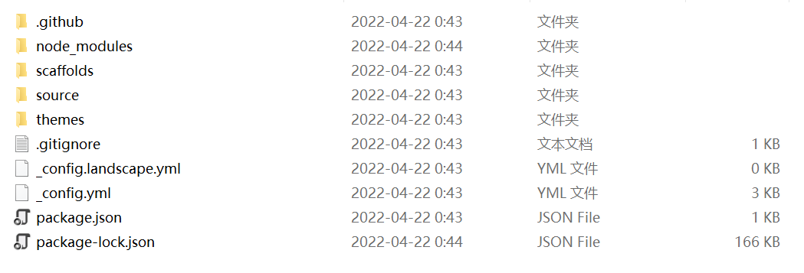

这里有一些比较重要的文件或文件夹：

- `_config.yml` 文件：站点的配置文件
- `source` 文件夹：存放需要进行渲染的文件，该目录下的 `_post` 文件夹内存放我们写的博文
- `themes` 文件夹：存放主题及其配置文件

### 1.5 测试网页

在Git Bash中输入命令，将网页生成至本地服务器上。

```
hexo server     #也可输入缩写命令hexo s
```

在浏览器地址栏中输入 `http://localhost:4000` 即可访问hexo的默认页面，如下图所示。如能正常访问页面，说明hexo在本地安装正常，按Ctrl+C停止。

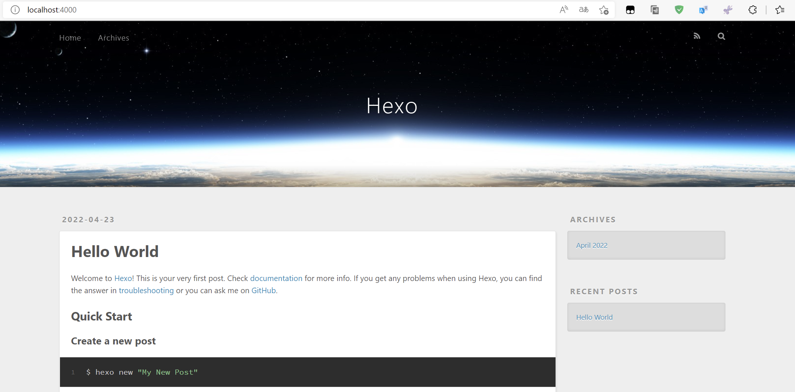

## 2. 服务端配置（CentOS 8.2）

在这一步骤中，我们将在服务器上安装hexo及其环境，配置git的自动部署和nginx。我们需要在本地计算机上安装XShell和WinSCP以访问我们购买的服务器。注意，**除特殊说明外，以下所有需要输入指令的操作都在服务器上完成**。

### 2.1 服务器初始设置

这里以腾讯云服务器为例，进入腾讯云网站的服务器管理后台，记录服务器的公网ip，如图所示。

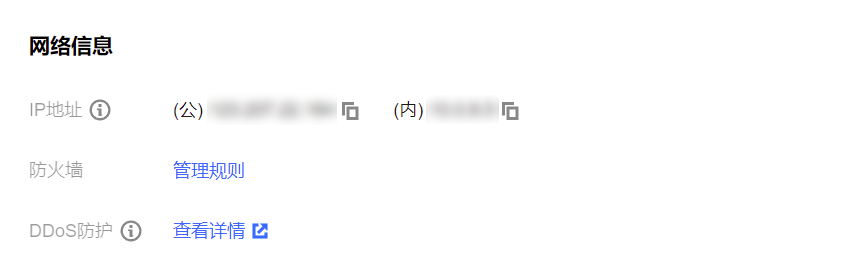

我们还需要重置密码，这里设置的密码将会是远程登陆服务器时root用户（即管理员账户）的密码。

检查服务器防火墙设置，查看80端口、443端口和22端口是否开放，如图所示。若无则需添加规则开放这三个端口。

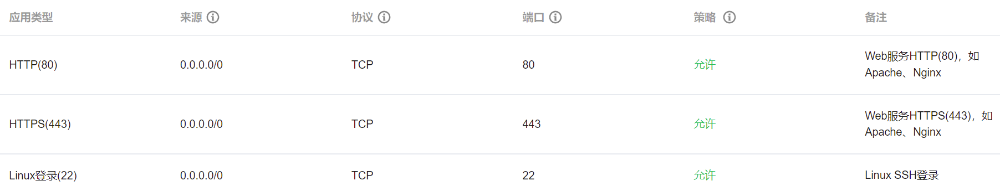

### 2.2 访问实例

这里的实例可以理解为安装了操作系统的一台服务器。我们需要在本地计算机安装XShell和WinSCP，前者用于访问远程实例的控制终端，后者可以让我们更加便捷地访问服务器上的文件，便于后续操作。

(1) 打开XShell并新建会话，如图所示。

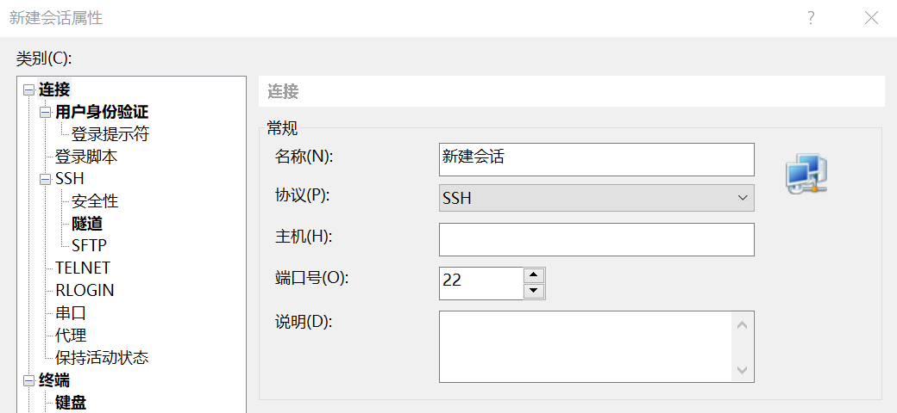

输入连接信息：

- 协议：SSH
- 主机：服务器公网ip
- 端口号：22

选择“用户身份验证”选项卡，输入用户名和密码并连接。一般情况下用户名为root，密码则为前面重置密码时设置的密码。连接成功后，会出现实例的控制终端，如图所示。

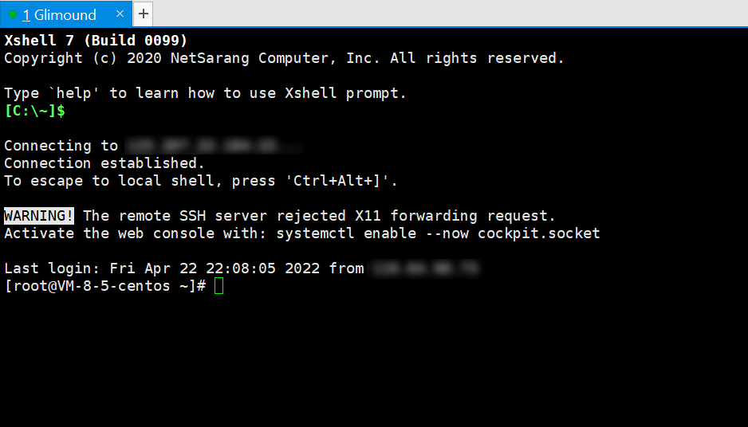

(2) 打开WinSCP并新建站点，如图所示。

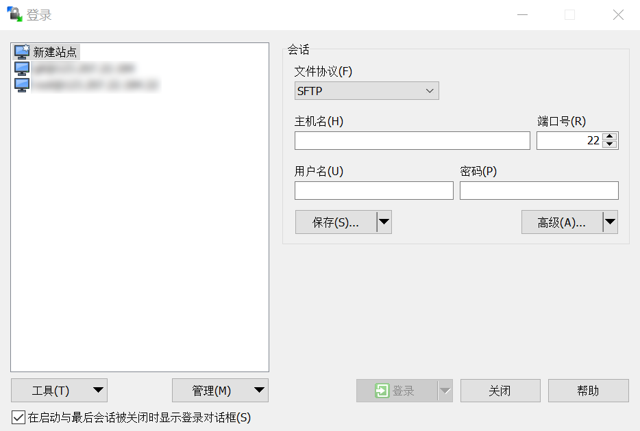

输入连接信息、用户名、密码：

- 文件协议：SFTP或SCP
- 主机名：服务器公网ip
- 端口号：22

登录成功后会出现如下界面，左半栏为本地计算机的文件目录，右半栏为服务器的文件目录，可进行上传及下载操作。

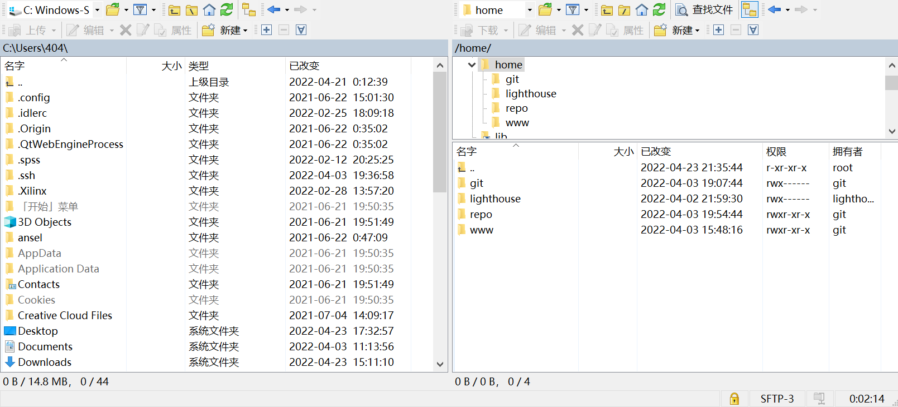

### 2.3 创建Hexo部署目录

用XShell登录实例后，在终端中输入以下命令创建Hexo部署目录（路径可根据喜好自行设置），博客相关的页面文件将会被存储在此处。

```
mkdir -p /home/www/hexo
```

### 2.4 安装Nginx

(1) 在终端中依次输入以下命令，使用yum安装nginx所需的依赖。这里的yum同样为包管理器，不过是CentOS系统内置的，功能与npm基本相同。

```
yum install gcc-c++
yum install -y pcre pcre-devel
yum install -y zlib zlib-devel
yum install -y openssl openssl-devel
```

gcc-c++为编译nginx源码所需的编译器；pcre为正则表达式的支持库；zlib为压缩算法的支持库；Nginx支持http与https协议，如需实现https协议需要用到openssl库。

(2) 访问官网的[下载页面](http://nginx.org/en/download.html)，查看稳定版nginx的版本号，并在终端中输入指令下载nginx的源代码。这里以1.20.2版本为例。

```
wget -c http://nginx.org/download/nginx-1.20.2.tar.gz     #用wget命令下载源代码的压缩包
tar -zxvf nginx-1.20.2.tar.gz -C /usr/local     #解压压缩包至/usr/local目录下
```

解压完成后在WinSCP中刷新页面，可以看到 `/usr/local` 目录下多出了解压后的nginx源代码文件夹。

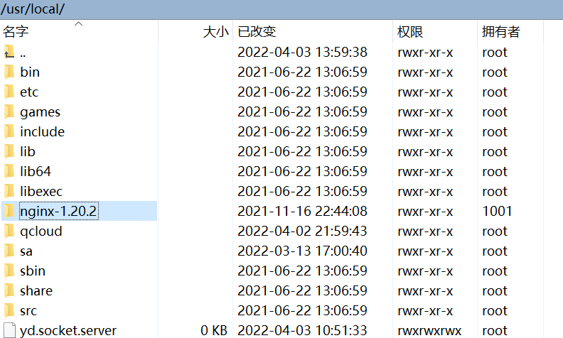

(3) 在终端中进入该目录，执行配置文件。

```
cd /usr/local/nginx-1.20.2
./configure --with-http_ssl_module     #http_ssl_module为https模块
```

(4) 编译安装nginx。

```
make
make install
```

(5) 若按以上方法安装，默认安装目录为 `/usr/local/nginx` 。进入sbin目录，启动nginx。注意，启动成功后在终端中不会显示任何信息，而在已启动nginx的情况下再次试图启动会显示错误信息（可据此粗略判断nginx是否启动）。

```
cd /usr/local/nginx/sbin
./nginx -v     #显示nginx版本号，说明安装成功
./nginx     #启动nginx
```

启动后在浏览器地址栏中输入 `http://你的服务器ip:80` 即可看到nginx的欢迎页面，如图所示。

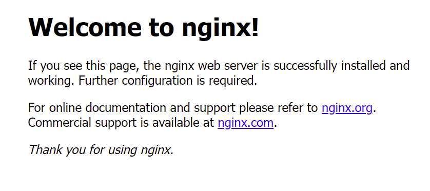

在这里附上一些常用的nginx命令，注意，以下命令均需要在 `/usr/local/nginx/sbin` 目录下执行。

```
./nginx -s stop     #关闭nginx
./nginx -s reload      #重载nginx
./nginx -t      #检查nginx配置文件的语法是否有错误，常在修改配置文件后执行
```

### 2.5 配置Nginx反向代理

在WinSCP中进入nginx配置文件所在的目录 `/usr/local/nginx/conf` ，右键nginx.conf文件并进行编辑。（此处也可在终端中通过vim修改： `vim /usr/local/nginx/conf/nginx.conf` ；下文凡涉及文件修改的操作均可在终端中完成，这里选择在WinSCP中操作是为了更直观）

找到server语句块，如图所示。

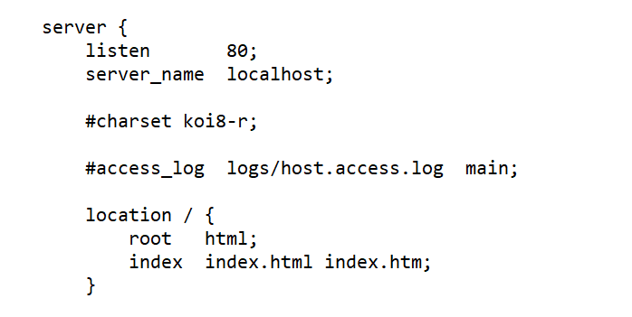

进行以下修改：

- listen为监听端口，保持默认80即可
- server_name为虚拟服务器的识别标志，修改为自己注册的域名，如 `www.glimound.com`
- root为部署根目录（即用户访问时网页文件所在的目录），修改为前面创建的Hexo部署目录，如 `/home/www/hexo`

修改完成后检查语法并重载nginx。

```
./nginx -t
./nginx -s reload
```

### 2.6 安装Git

在终端中用yum安装Git。

```
yum install -y git
git --vesion     #显示git版本号，说明安装成功
```

### 2.7 添加git用户

(1) root用户默认的权限过大，出于安全考虑，我们为服务器添加一个名为git的用户，用于将博客自动部署至服务器上。

```
useradd git     #添加名为git的用户
passwd git     #修改git用户的密码
```

(2) 为git用户授予sudo权限，用WinSCP打开 `/etc` 目录下的 `sudoers` 文件，在 `root ALL=(ALL) ALL` 语句下添加 `git ALL=(ALL) ALL` ，如图所示。

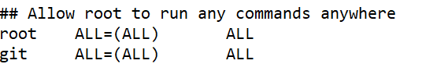

### 2.8 为git用户添加SSH密钥

目前为止，对git仓库进行的所有操作都需要输入密码，我们可以通过为git用户添加SSH密钥的方式来实现免密登录。原理：在本地生成一对密钥文件（分别是公钥和私钥），将公钥文件上传到服务器上；服务器收到连接请求时，会将本地的公钥与服务器的公钥进行比对，用私钥解密服务器发来的一段信息并将其发回，验证通过后准许连接。

(1) 在**本地计算机上**打开Git Bash，生成密钥对。

```
ssh-keygen
```

输入指令按enter键后会提示输入密码，这里也可不填，一路按enter即可。运行完后将会在 `C:\Users\用户名` 目录下生成.ssh文件夹，文件夹内的 `id_rsa` 为私钥文件，`id_rsa.pub` 为公钥文件。

(2) 在linux下，文件名以小数点开头的文件被视为隐藏文件，在WinSCP中设置显示隐藏文件以方便后续操作。打开WinSCP–选项–选项–面板，勾选“显示隐藏文件”，如图所示。

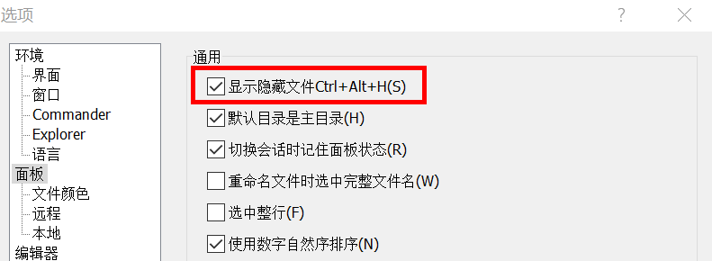

(3) 在 `/home/git` 目录下右键新建名为 `.ssh` 的文件夹，并在该文件夹内新建名为 `authorized_keys` 的文件，将之前生成的公钥文件中的所有内容复制进去，保存。

(4) 在XShell中连接实例，登录为root账户，为公钥文件和文件夹设置权限。

```
chmod 600 /home/git/.ssh/authorized_keys
chmod 700 /home/git/.ssh
```

chmod命令可设置文件或文件夹的权限，三位数字为linux中的权限代码，介绍及教程在[这里](https://www.runoob.com/linux/linux-comm-chmod.html)。

(5) 将.ssh文件夹及其内的文件所有权移交给git用户。

```
chown -R git:git /home/git/.ssh
```

chown命令可以变更目录或文件的所有者，-R参数是对子目录及其内的所有文件生效。

(6) 在**本地计算机**测试是否可以用ssh免密登录服务器。打开Git Bash，连接实例，若配置成功则无需输入密码。

```
ssh -v git@xxx.xxx.xxx.xxx     #git@后填写服务器的公网ip
```

### 2.9 创建Git仓库并配置自动部署

这里的Git仓库（repository）可以理解为一个存放着不同版本代码的代码库，包含了项目所有的源文件和版本控制信息。但我们在这里需要用到的是裸库，即仅包含版本控制信息的仓库。后者不保存文件，常用作服务器仓库，实现数据共享和同步。

自动部署的核心在于git-hooks（钩子），可以理解为一种脚本，在特定条件下触发时会调用钩子并执行钩子文件中的内容。

(1) XShell登录为root用户，新建目录并在该目录下创建Git仓库。

```
mkdir -p /home/repo     #该目录为git仓库所在的位置，可根据喜好自行设置
cd /home/repo     #进入该目录
git init --bare blog.git     #创建一个名为blog的仓库，--bare参数为创建裸库
```

(2) 在WinSCP中进入 `/home/repo/blog.git/hooks` 目录，找到 `post-receive` 钩子文件（若无则新建）。

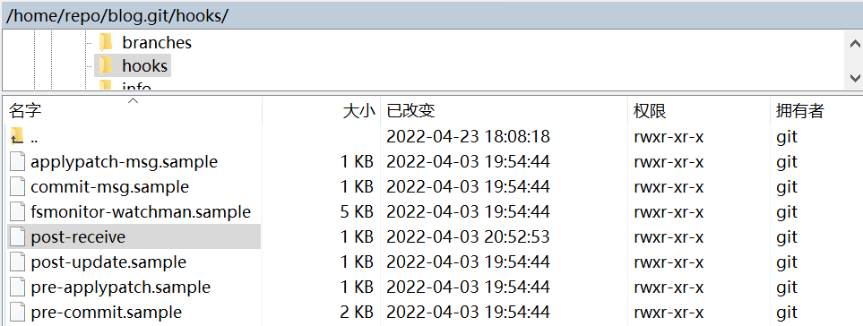

右键编辑，输入 `git --work-tree=/home/www/hexo --git-dir=/home/repo/blog.git checkout -f` 并保存。（work-tree填写hexo的部署目录，git-dir填写Git仓库的目录）

这里我们使用的是 `post-receive` 钩子，当Git收到push请求的时候就会调用这个钩子。这个钩子中添加的语句执行的操作为：删除hexo部署目录中原有的文件，然后将Git仓库中的内容clone至hexo部署目录下。这样我们在本地更新博客并且执行部署命令后，网页文件会被push至服务器的Git仓库内，钩子文件则会将Git仓库内的网页文件复制到hexo部署目录下，从而实现自动部署功能。

(3) 为钩子文件及Git仓库目录配置权限。这里需要将我们创建的仓库及部署目录的所有权移交给git用户，因为linux下创建文件时默认只有拥有者（即创建者）才具有读写权限，而Git进行push操作时登录的用户为git用户。

```
chmod +x /home/repo/blog.git/hooks/post-receive     #为钩子文件授予可执行权限（+x）
chown -R git:git /home/repo     #将仓库目录的所有权移交给git用户
chown -R git:git /home/www/hexo     #将hexo部署目录的所有权移交给git用户
```

## 3. 其他配置

### 3.1 Hexo部署插件安装及配置

在本地计算机的hexo文件夹，这里是 `D:\Blog\myblog` ，打开 `_config.yml` 文件，找到 `deploy` 语句并进行修改，如图所示。

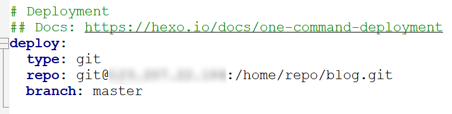

type改为git，repo改为 `git@服务器ip:git仓库目录` ，这样在执行部署命令时，hexo就会用git用户登录服务器，并将生成的网页文件push到服务器的git仓库中。

输入以下命令生成网页文件并部署至服务器上。

```
hexo clean && hexo generate && hexo deploy
```

在WinSCP中进入服务器的 `/home/www/hexo` 目录并刷新，查看是否出现文件（该目录原为空目录），如图所示。若有则说明hexo的部署插件及服务器的Git自动部署运行正常。

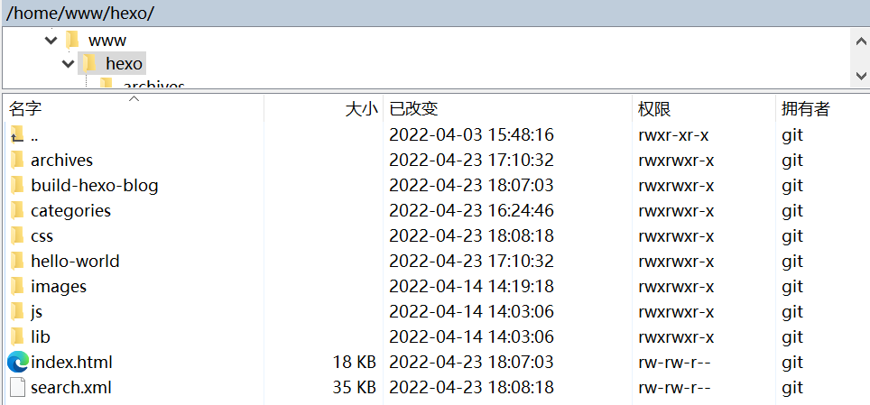

至此，我们已经可以在浏览器中输入服务器的ip地址来访问博客站点。

### 3.2 设置域名解析

域名解析可以将域名指向服务器的ip地址，这样访客输入域名即可访问我们的博客。进入域名管理后台，这里以阿里云的万网为例，在解析设置中添加记录，如图所示。

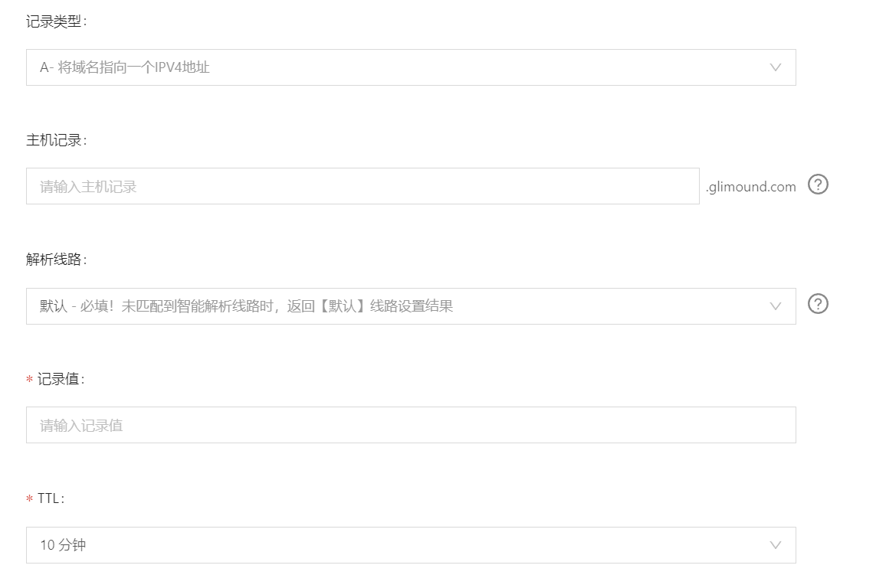

填写相关信息：

- 记录类型：默认为A即可
- 主机记录：www，或根据需要自行设置
- 解析线路：默认
- 记录值：服务器公网ip
- TTL：默认为10分钟即可

### 3.3 网站备案

根据法律法规要求，提供非经营性互联网信息服务必须对网站进行ICP备案（需要提交服务器ip、域名、网站信息、网站运营者的身份信息），具体流程详见接入商（即服务器提供商）提供的帮助文档。未进行ICP备案的网站在通过域名进行访问时，会被接入商的检测系统识别并阻断访问。这里以腾讯云为例，进入腾讯云备案页面，根据流程进行ICP备案。

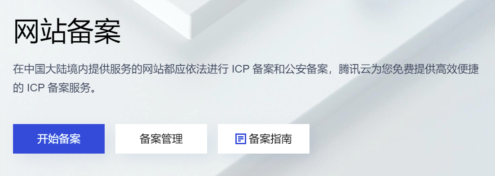

ICP备案审批会在20个工作日内通过，在备案完成前，仍可通过ip地址的方式访问博客站点。注：解析至境外服务器的域名无需进行备案。

ICP备案完成后，需将备案号显示在网站页面下方；此外，根据不同省份及地区的政策，可能还会要求进行公安备案，详见接入商提供的帮助文档。**至此，我们已经完成了博客站点的所有基本配置**，等待备案完成后即可从域名访问属于我们自己的博客网站。

### 3.4 可选操作：为网站配置ssl证书及https协议访问

https的具体原理在这里不再赘述，简单来说就是一种更加安全的加密通信协议，需要我们在服务器上安装数字证书以建立SSL加密通道。为网站开启https可以提高网站在搜索引擎中的排名，同时浏览器地址栏旁边也会显示一把小锁，说明我们的连接是安全的。


企业级数字证书通常价格较贵，一般用于商业网站的加密，而我们在这里选用免费的DV（域名型）证书。以腾讯云为例，可以在腾讯云网站申请免费数字证书，填写域名信息并进行所有权验证，验证通过后即可下载已签名的数字证书；证书有效期为一年，每年到期前续签即可。

(1) 申请ssl证书成功后，下载用于nginx服务器的证书，得到四个文件，如图所示。

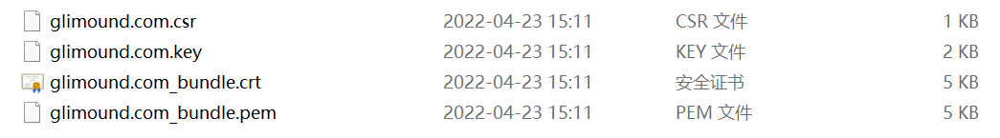

- `xxx_bundle.crt` 证书文件
- `xxx.key` 私钥文件
- `xxx.pem` 证书文件（安装时可忽略该文件）
- `xxx.csr` CSR 文件（安装时可忽略该文件）

(2) 使用WinCSP登录服务器，将上一步下载到本地的 `xxx_bundle.crt` 证书文件和 `xxx.key` 私钥文件复制到 `/usr/local/nginx/conf` 目录下。

(3) 在该目录下找到nginx.conf文件，右键编辑，找到HTTPS server代码块，如图所示。

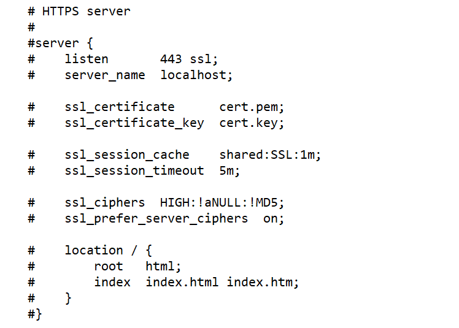

进行以下修改：

- 取消该代码块的注释
- server_name：修改为域名
- ssl_certificate：修改为证书文件的文件名，如 `xxx_bundle.crt`
- ssl_certificate_key：修改为私钥文件的文件名，如 `xxx.key`
- ssl_ciphers：即使用的算法，参照接入商提供的文档进行修改
- root：修改为Hexo部署目录
- **注：需要修改的内容可能因服务器提供商不同而有所差异，以接入商提供的文档为准**

(4) 如需访问网站时默认使用https协议，可以设置http重定向为https，在**HTTP的server语句块**中添加 `return 301 https://你的域名` 即可，如图所示。

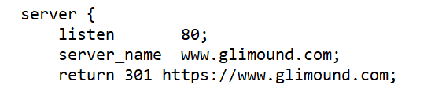

(5) XShell连接服务器，检查nginx语法并重启nginx。

```
cd /usr/local/nginx/sbin
./nginx -t
./nginx -s reload
```

浏览器访问 `https://你的域名` 就可以看到地址栏的小锁啦。

### 3.5 附：常用Hexo命令

```
hexo clean     #清除缓存（在本地已渲染的静态文件）
hexo generate     #生成静态文件
hexo deploy     #将静态文件部署至服务器
#上面三个命令常常连用：hexo clean && hexo g && hexo s

hexo server     #将静态文件部署至本地服务器，常用于调试
hexo new "title"     #新建名为title的文章，位置为本地站点文件夹\source\_posts，打开title.md即可编辑文章（.md为markdown文件的后缀名）
```

更多命令可访问Hexo官网的[帮助文档](https://hexo.io/docs/)获取。

### 3.6 附：错误排除

- hexo部署目录内无文件：检查hexo部署目录、git仓库目录、钩子文件的权限配置；检查本地博客的 `public` 目录内是否存在成功渲染的网页文件；重启实例
- 无法访问服务器ip地址：完成上一步骤的检查；检查nginx是否处于开启状态；检查 `nginx.conf` 配置文件
- 无法访问域名：完成上一步骤的检查；检查域名解析状态；确认ICP备案是否已经完成

# 四、结语

🎉🎉至此，我们就完成了基于hexo的博客搭建，并已经将博客站点部署至云服务器上。

当然，默认的hexo主题比较单调，我们可以搜索不同的主题来安装（我使用的是NexT主题），并通过修改 `_conig.yml` 文件对博客进行详细配置。同样，Github上也有比较多的第三方插件供我们对博客进行拓展、美化。预计接下来一段时间，我也会写一篇文章来介绍博客的NexT主题详细配置及美化教程。

在搭建博客的过程中难免会遇到各种各样的问题，而**尝试解决问题本身就是进步的过程**。